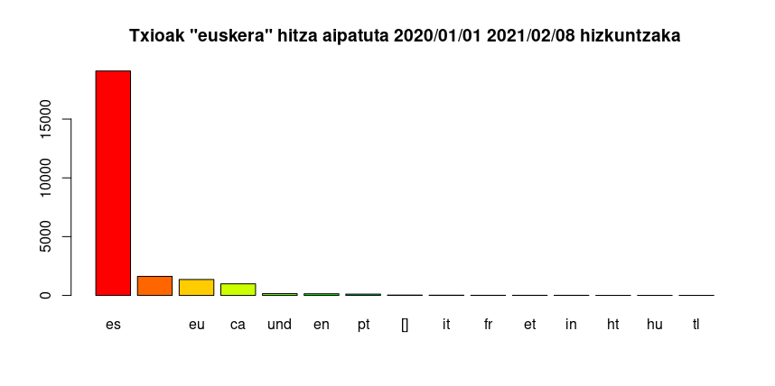

Gaurkoan kolpe nahi diot alderdi batetik eta bestetik agertzen izan zaidan aplikazio bati: [Iramuteq](http://www.iramuteq.org/)

Euren webgunean diote testuen eta galdetegien analisi dimentsio anitza egiteko R-ren interfacea dela; beraz ez naiz lar urrunduko nire ohiturazko kontuetatik.

Iramuteq garatzen dute LERASSen barruan (*Laboratoire d'Études et de Recherches Appliquées en Sciences Sociales*) eta garatzaile ikertzaile mantentzaile nabarmenena [Pierre Ratinaud](https://www.lerass.com/author/pratinaud/) da, Frantziako Tolosako unibertsitatekoa.

{width=90%}

Aplikazio honen helburua da Reinertek (1983) proposatutako analisia bide errezagoan eta librean ezartzea. Horretaz gain beste zenbait aukera ere ematen ditu analisirako eta datuen aurkezpenerako.

Hasteko, etiketatutako corpusa behar da; intersa duen irakurleak beste nonbait irakur beza nola egiten den, baina jakitea dauka testu zati bakoitza mugatuta egon behar dela eta gutxienez aldagai bat izan behar duela dagokion etiketarekin.

+ Corpusaren estatistika orokorrak
    + Formak
    + Formak lematizatuta
    + Formen gertaldiak
+ *AFM* izenez agertzen den analisia, *analyse factorielle des correspondances*[1](http://www.iramuteq.org/documentation/html/copy3_of_2-5-1-3-options-supplementaires-de-lanalyse-statistique-textuelle-sur-chaque-forme). Nire begitazioa da hori MCA dela. *Multiple Correspondences Analysis* ingelesez  
    Analisi mota horrekin faktoreak sortzen ditu norberak aurrez aukeratutako aldagaien arabera. Horrek lehenengo hurreratze baterako balio lezake.  
    Multzokatzeak identifikatzen ditu, formen artean dagoen distantziaren arabera. Multzo horien forma adierazgarrienak ere ematen ditu zutabeetan eta berba-hodeietan, hala aztertu nahi izanez gero.  
    Multzoak egiteko orduan multzoetako forma osagaiak ere eskuragai uzten ditu, forma bakoitzak zenbat gertaldi dituen, zenbat gertaldi multzoan eta multzoarekiko atxikipenaren ideia ematen duen $\chi^2$ bere p-balioarekin.
+ Reinert-en metodoa  
    Horixe da honen izarra: Helburua du testu zati multzoak zehaztea hurbiltasun lexikoan oinarrituta, antzeko testuinguruan erabiltzen direnak mundu lexiko batekoak direla ulertuta, Salviatik (2017) idatzitako manualetik laburtuta. Analisia hitzen erroan ardazten du eta taldekatzearen adierazgarritasuna zehazten du $\chi^2$ren bitartez.  
+ Antzekotasun analisiak  
    Honetan hitzak corpusean elkarrekin nola dauden harremanetan irudikatzen du.
+ Hitz-hodeiak
+ Azpi-corpusak sortzeko aukera

+ Kasu guztietan forma bat aukeratzen denean testuinguruan azter daiteke nola agertzen diren berbok testuinguruan.
+ Adibideokin, gainera, azpi-corpusak ere sor daitezeke aurrez zehaztutako analisi guztiok egin ahal izateko eta corpusaren ezaugarriak hobeto aztertzeko.
    Esate baterako, "euskera" hitza Twitterren nola aipatzen den aztertzeko orduan ikusi dut "navarra" hitzarekin askotan agertzen dela. Azpi-corpus interesgarria zatekeen "navarra" hitza dutenak aztertzea.
    
# Adibidea eraiki.

Lehenengo pausua izan zen begiratzea zer azter daitekeen Iramuteq erabilita. Zelan egiten duen eta zelan aztertzen duen ulertuta. 

Lehenengo ahalegina: aurkitu Covid-19 gainean jendeak zer txiokatzen duen euskaraz, zelan eraikitzen den zein kontzeptu-eta aztertzeko.

Eta arazo nagusi batekin egin nuen topo: hizkuntza.

Iramuteqek testuak aztertzeko hiztegia behar du eta ez da egon euskarazko testurik.

Beraz, **euskarazko hiztegiaren eraikuntza** stand-by utzita, gaztelaniaz aztertzea erabaki nuen.

Bigarren ahalegina, bera ere Twitter erabilita, ea zer esaten den *#vascuence* hashtagarekin^["traola traola traola, jurjia meneko treotzaria..." *traola* beste zerbait da-eta]. Basamortua. Ez dago dozenatxu bat baino. 

> -: Hitza soilik?

Urtebetean *vascuence* hitzarekin 5829 tweet... eta... eta *euskera* hartuta zer?

> -: 39211 tweet... Polito!

## Azterketaren eraikuntza: *euskera* hitza Twitterren

{width=100%}

Hemen eraikuntzaren azalpena eta hurrengo batean analisia bera.

2020ko urtarrilaren 1etik 2021eko otsailaren... ez dakit ze egunetara arte, idatzitako tweet / txio guztiak jaitsi ditut; horien sailkapen arin bat egin dut euskarari buruz zer eta zelan esaten den aztertzeko.

Lehenengo garbiketan testu huts bihurtu behar dira txio guztiak, emojiz-eta garbituta. Gero gaztelaniaz idatzitako txio guztiak gorde, besteak baztertzeko eta amaieran aldagaiak sortu eta etiketatu.

{width=100%}

Hizkuntzak automatikoki detektatutakoak dira, horregatik askotan txarto detektatuta daude: portugesaren ordez gehienak galegoa, frantses batzuk katalana eta katalan batzuk frantsesa, euskaratzat hartutako batzuk gaztelania eta gaztelaniatzat hartutako zenbait euskara.

Uste nuen eragin zezaketela ikuskera nagusi bik:

+ Gaiaz txiokatzeko joera. "euskera" aipatuta txiokatzeak bazitekeen zelan edo halan horrekiko joeraren erakustea
    + Behin
    + Gutxitan
    + Nahikotan
    + ...
+ Txiokatzeko hizkuntzak:
    + Gaztelaniaz soilik
    + Gaztelaniaz eta euskeraz
    + Gaztelaniaz eta inglesez
    + Gaztelaniaz, euskeraz eta inglesez

# Amaierako kontu bat: dimentsio kultural eta politikoa

Izenetik bertatik, *IRaMuTeQ: Interface de R pour les Analyses Multidimensionnelles de Textes et de Questionnaires* frantsesa dariola ikusten da.  
Neuk ere nahi dut gurerako!

Sustengurako banaketa zerrenda dauka frantsesez ederto dabilena. Ingelesez Pierrek berak ere erantzuten du, baina zatia emankorragoa da frantsesez erabiltzea.

Zerrenda horretan galderaren bat edo beste egin dut eta arin batean argitu dizkidate zalantzak; baina nabarmenena da, ikustea zenbat tokitako jendeak idazten duen frantsesez euren lanetan eraginkorrago egiteko. Ingelesa jaun eta jabe den sasoi honetan, ikusgarri hori lortzea.

Amaitzeko, barruko eragiketa guztiak frantsesez izendatzen eta azaltzen ditu. Beraz, nahiz eta interfacea beste hizkuntzaren batean erabili, frantsesaren presentzia behin eta berriz somatzen da barruko eragiketetan eta sortzen dituen fitxategien izenetan.

## Zergatik nabarmendu dudan hori?

Euskaraz ere egin daitekeelako lan. `irteera.csv` edo `laburpena.pdf` izeneko fitxategiak sortzen dituzten nazioarteko aplikazioak egin litezke, Tolosan, Nairobin edo Seulen dabilenak erabiltzeko.

# Erreferentziak

Ratinaud, Pierre. (2014). *IRaMuTeQ: Interface de R pour les Analyses Multidimensionnelles de Textes et de Questionnaires* [Linux]. http://www.iramuteq.org

Reinert, A. (1983). Une méthode de classification descendante hiérarchique: Application à l’analyse lexicale par contexte. *Les cahiers de l’analyse des données*, 8*(2)*, 187–198.

Salviati, M.S. (2017) *Manual do Aplicativo Iramuteq* Planaltina

