[Aurreko postean](https://juanabasolo.netlify.app/2021/04/05/ideien-azterketa/) gainetik aztertu nuen [IRaMuTeQ](http://www.iramuteq.org/) zer den eta zelan erabiltzen den. Oraingoan horren adibide bat erakutsi nahi dut. Irakurleak izan bitza kontuan hauek:

-   Erabiltzen ikasteko ariketa garatuxea baino ez da
-   Oraindik ez dago euskaraz zuzenean (eta ganoraz) erabiltzeko erarik, horregatik gaztelaniaz egin dut
-   Ariketa hau egiteko Twitterreko datuak erabili ditut ausaz, Twitter jazteko [beste aplikazio bat](https://github.com/twintproject/twint) erabiltzen ikasi bitartean.

# Euskarari buruz zer txiokatu da azken urtebetean gaztelaniaz?

Abiapuntua horixe dela esan liteke. Labur eta txarto, jakina, gaztelaniaz zer esaten den aztertzeko "euskera" hitzaz gain "vascuence", "lengua vasca", eta "vasco" ere aztertu behar bailitzateke; eta zenbait euskaldunek "euskara" hitza ere erabiltzen dute gaztelaniaz.

Lehenenengo bilaketa batzuk eginda, bistan egon da "vasco" hitza asko erabili arren, oso zaila dela automatikoki aztertzea zeri buruz ari den, "Lengua vasca"k Euskaltzaindiaren aipamenetara garamatza, "vascuence"... hori ere aztertu dut, hurrengo baterako ;-)

Azkenez *euskera* berba emankorra izan zitekeela uste izan dut, maite dutenek hori erabiltzen dute, eta maite ez duten askok eta askok ere bai, Hego Euskal Herriko erderazko izen estandarra dela esango nuke, baita Espainiakoa ere. Nik gaztelaniaz *vasco*, gure etxean beti esan den moduan.

Aldagai bi hartu dira kontuan sailkapena egiteko, biak egileen portaeratik eratorriak:

-   Zenbat mezu bidali dituen egileak *euskera* aipatuta.\
    Aldagai honek bost maila ditu.\
    + 50 mezu baino gehiagotan aipatzen dute *euskera*, 1170 mezu 
    + 50 eta 10 mezuen artean aipatzen dute, 1740 mezu 
    + 4 eta 9 mezuen artean, 2628 mezu 
    + 2 edo 3 mezuen artean, 3819 mezu 
    + mezu bakarra, 7892 mezu

-   Zein hizkuntzetan txiokatu duen *euskera* hitza aipatuta.\
    Aldagai honetan hiru maila ezarri dira 
      + gaztelania hutsean 
      + gaztelaniaz eta euskaraz 
      + gaztelaniaz eta ingelesez  
  Bakar batek txiokatu du, *euskera* hitza aipatuta gaztelaniaz, euskaraz eta ingelesez, ez dugu beste kategoriarik sortu horrentzat.  
  Beste hizkuntzetan txiokatutako gehienek ez dute gaztelaniaz ere txiokatu.

## Lagina

Twitterren, 2020ko urtarrilaren 1etik 2021eko otsailaren 25era bitartean, *euskera* hitza (edo *\#euskera*, etiketatzat hartuta) txiokatutako mezu guztiak jaitsi ditugu metadatu guztiekin.

-   39211 mezu

Horietatik gaztelania moduan Twitterrek automatikoki sailkatutakoak baino ez dira aukeratu, errepikatuetatik edo oker jaitsitakoetatik erantsita.

-   18725 mezu gaztelaniaz *euskara* aipatuta

Jatorrizko mezuei garbiketa prozesu bat egin zaie R lengoaian idatzitako script baten bitartez, segidan kodearen gunea, aipamenak, etiketak, estekak, emojiak, tildeak eta abar garbitzeko.

``` {.r}
tweetak$tgarbiak <- x %>% 
  iconv(to="ASCII//TRANSLIT") %>% iconv(to='UTF-8') %>% 
  tolower() %>% 
  str_replace_all("@\\w+", ' ') %>% 
  str_replace_all('htt[p|ps]\\w+', ' ') %>% 
  str_replace_all('[:punct:]', ' ') %>% 
  str_remove_all('[^[:ascii:]]') %>% 
  str_replace_all("[ |\t]{2,}+", ' ') %>% 
  str_replace_all("[ |\t]{2,}+", ' ') %>%   
  str_remove_all('^ ') %>% 
  str_remove_all(' $') %>% 
  str_remove_all('^\\{.*')
```

Amaitzeko, sortutako corpusa lematizatu egiten da azterketarako, IRaMuTeQek horretarako dakarren hiztegia erabilita.

Mezu guzti horietan 505888 forma identifikatu dira prozesuan, horietatik 26574 lema zehaztu dira, euretatik, 15625 behin baino ez dira agertzen.

Aplikazioak edukiz hornitutakoak (*euskera*, 20572 gertaldi; *hablar*, 5618 gertaldi; *castellano*, 2848 gertaldi...), eta gehigarriak edo hutsalak (*el*, 41311 gertaldi; *que*, 20995 gertaldi... *yo*, 5705 gertaldi... ) desberdintzen ditu

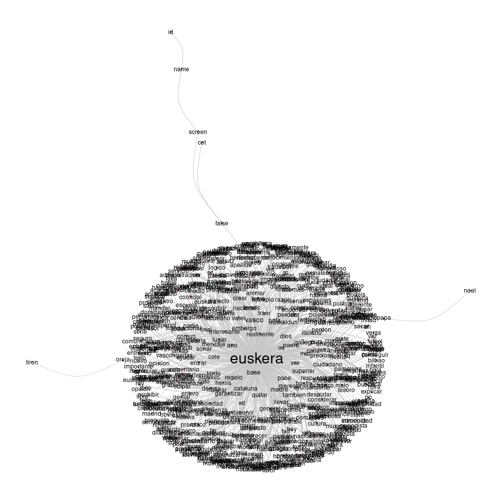{width="80%"}

Goiko irudiak erakusten du, corpus osoan aztertutako berben egituretan oinarrituta, nolako antzekotasunak azaleratzen diren.

Agerian da ez dagoela antzekotasun handirik hiru kasutan izan ezik:

-   *Papa* eta *Noel*
-   *Tiron* eta *orejas*
-   *False* eta *screen* eta *name* eta *id*.  
    Azken hori ematen du azalpen teknikoak argituko lukeela


## Azterbidea

Hori aztertzeko bide bi hartu dira.

Batean [Korrespondentzia-analisia](https://eu.wikipedia.org/wiki/Korrespondentzia-analisi) (CA, ingelesezko akronimoan) bana erabili da aldagai biekin; hau da, kontigentzi taula batean lema guztiak eta aldagaietako mailak erkatzen dira, korrezpondentziak aurkitu nahirik.

Bigarren bidean, berriz, faktore anitzeko analisia erabilita, aztertzen da nola antolatzen diren testu zatiak edo mezuak. Twitterreko mezuez ari garenez, azterketa honetan testuak osorik hartu dira kontuan eta ez zatituta, Reinert-en (1983) lehenengo formulazioan agertzen zen moduan.

Edukizko formak eta forma hutsalak desberdintzen ditu analisiak, era bietako formak osorik aztertzen ditu azaldutako prozesu horretan.

## Azterketa

Twitterren zer esaten da edo zeri buruz txiokatzen dute *euskera* hitza gaztelaniaz aipatzen dutenek?

*Euskera* aipatuta egindako txioen azterketak segidan

### Txiolarien jardunaren araberako ikuskera

Bi alderdiko taulako datuen azterketa bi dimentsiotako irudi batean bueltatzen du, horretan adierazten da datu guztien aldakortasunaren % 72 inguru bi dimentsiotan azal daitekeela; hori adierazteko irudi bi eskaintzen zaikigu, formen banaketarena eta aldagaiaren mailen araberakoa:

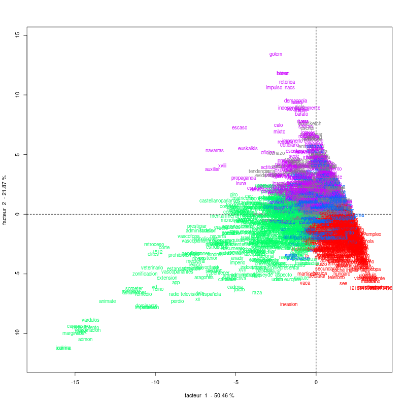{width="90%"}

Eta goiko irudi horren azalpenerako, idazleen jarduna *euskera* aipatuta kontuan izanda, plano horretan non kokatzen diren idazleen tipologiak

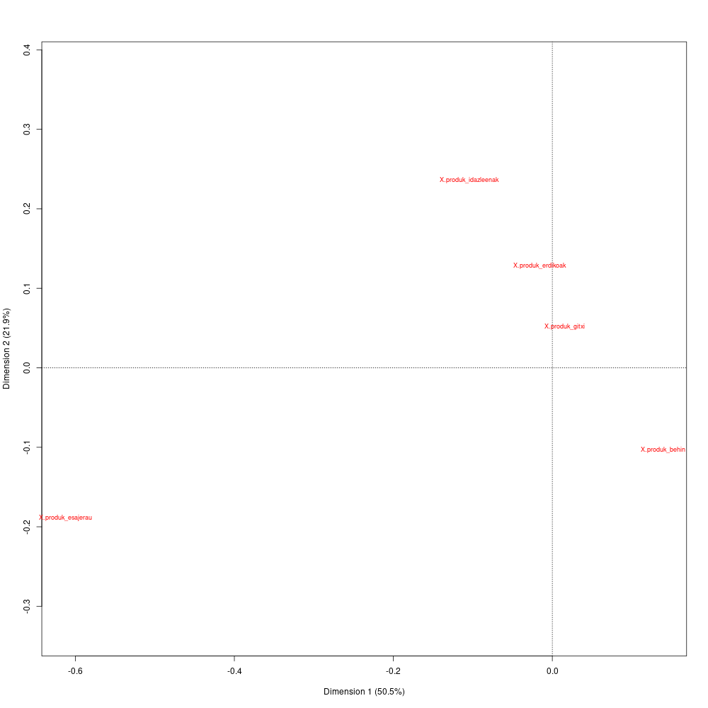{width="90%"}

#### Interpretazio laburra

Ematen du koherentea dela goian ikusten den banaketa hori aurrez erabakitako aldagaien deskribapenaz; aldakortasunaren % 72 inguru azaltzen duen irudi horretan erakusten denez, lehenengo dimentsioan koherenteki banatzen dira egileak, gutxien idazten dutenek eskuinen ikusten dira eta ezkerren gehien egiten dutenak, tarteko balioek ugaritasunarekin harremanetan dagoela ere ikusten da, mailak hauek direla:

1.  `X_produk_behin`
2.  `X_produk_gitxi`
3.  `X_produk_nahiko`
4.  `X_produk_idazleenak`
5.  `X_produk_esajerau`

Bigarren dimentsioak, berriz, aldakortasunaren % 21.9 azaltzen du eta hor ere antzematen da horrelako joera bat, baina gehien idazten dutenek ez dute erakusten beste guztietan ikusten den joera bera, kontrakoa baino. Delako ezaugarria *euskera* euren txioetan behin baino aipatu ez dutenek dutena, are markatuago ematen du dagoela gehien idazten dutenen artean.

### Txiolarien jardunerako hizkuntzen araberako azterketa

Hurrengo irudian ardatz biko proiekzio batean erakusten da 18725 txioen aldakortasuna "euskera" berba txioetan erabiltzeko hizkuntzaren arabera.

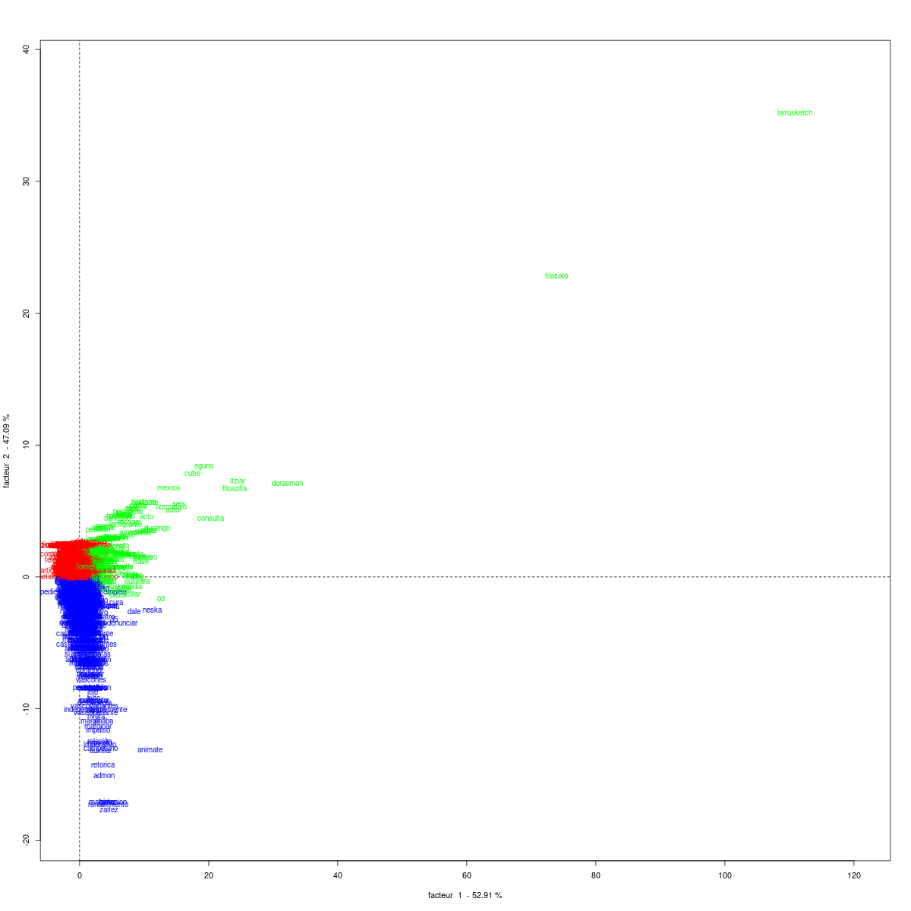{width="90%"}

Hiru koloreok balio dute lema horiek aldagaiko zein aldakirekin datozen bat ikusteko. Hurrengo grafikoan ikusten da eskumaren kokatzen direla `x_hizk_esen` etiketarekin markatutakoak, hau da, *euskera* hitza erabilita gaztelaniaz gain ingelesez ere txiokatu dutenak; horiei dagozkien formak berdez nabarmentzen dira.

Urdinez nabarmentzen dira `x_hizk_eseu` etiketadunek bereiziago erabilitako formak, hau da euskaraz eta gaztelaniaz txiokatu dutenek.

Eta, amaitzeko, gorriz eta 0 ardatzetik oso gertu agertzen dira `x_hizk_es` etiketadunei dagozkien formak.

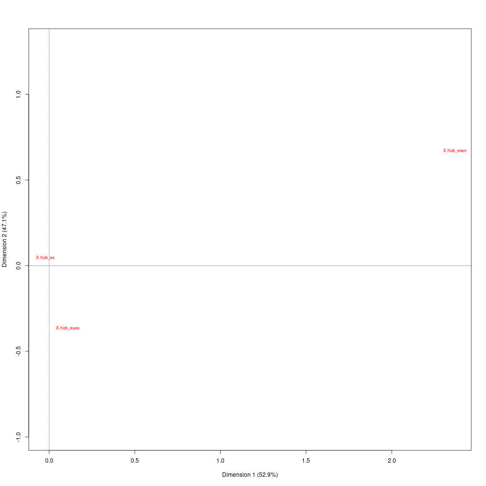{width="90%"}

#### Laburki

Goiko hirudiko kokapenak ikusita, ematen du zelanbaiteko aldea ikusten dela bigarren hizkuntza hori euskera ala ingelesa izan, baina gaztelania hutsean txiokatu dutenen kokapena ardatz bietako 0 puntutik hain urre egoteak adierazten du aldakortasunaren ikuskeran ez dagoela alde nabarmenegirik.

Urdinez irudikatutako formetan nabarmendu daiteke, gainera, batzuk hurrunago kokatzen direla aldagaiaren aldakia baino. Kasu horiek euskarazko formak dira, gaztelaniazko mezuetan txertatuak.

### Testuen arteko erlazioak

Beste aukera bat ematen du IRaMuTeQ aplikazioak, testu guztiak batu eta euren arteko erlazioak aurkitzen dituenak. Teknika horri erabiltzean ez da bilatu aurrez erabakitako `X` aldagaiaren araberako portaera, baizik eta diskurtsoak sortzeko erabiltzen diren testuen azterketatik abiatuta, ideien arteko erlazioak nabarmendu nahi dira, Reinert-en algoritmoan oinarrituta.

Analisi hori egin ahal izateko aplikazioak berez eskaintzen dituen balioak utzi zaizkio batean izan ezik, Twitter-eko datuak izatean algoritmoak huts egin lezakeelako baldin eta tolerantzia gehitzen ez bazaio; corpusaren %5eko gutxieneko taldeak sortu behar baiditu analisia eraiketzeko.

Hurrengo proiekzio honetan ikusten da nolako taldekatzeak eraiki dituen algoritmoak. Irudiko lemek sortzen dituzten hodeiak iradokitzen dituzte euskara aipatuaz Twitterren azken urte eta pikuan erabili diren diskurtsu nagusiak

 metodoaren araberako azterketa"){width="100%"}

Hiru talde garbiak irudikatzen ditu Reinert-en araberako analisiak. \
Analisi horrek sortzen dituen hiru talde diskurtsibo horiek erabilita aldakortasunaren % 100 azaltzen da.

Proiekzio horretan aldez aurretik erabakitako aldagaiak eta aldakiak non kokatzen diren ere ikus dezakegu, horretarako plano horretara baliook ezartzen dira hurrengo irudian

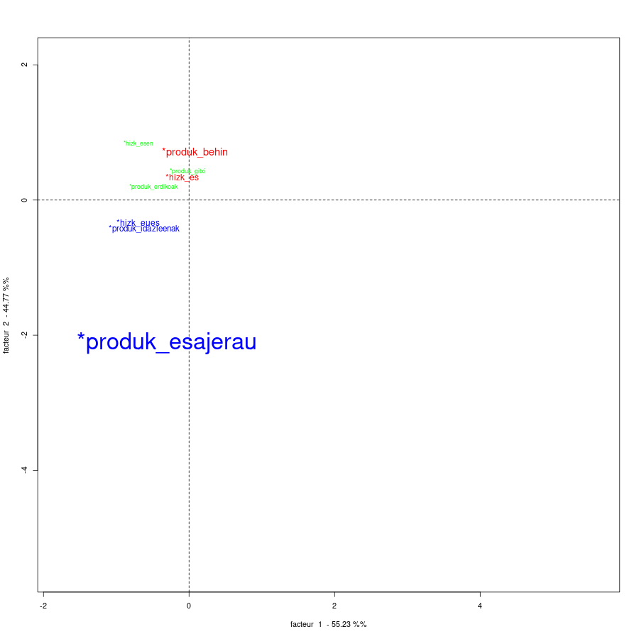{width="100%"}

Lehenengo begirada batean ematen du corpusaren egitura diskurtsiboa, aurrez zehaztutako aldagaiek baino hobeto, zehazten dutela bestelako ezaugarri batzuk.

#### Taldekatzeen diskurtso laginak eta beste

Tarte honetan sortutako hiru talde horien azterketa egiten da, lemen artikulazioen arabera zein zenbait adibideren bitartez.

##### Lehenengo taldea: *Espainiar estatua*

3071 txiok osatzen dute, corpusaren % 17.8

Talde honetan euskara bera gutxitan da gaia, sarri zerrendatze baten barruan agertzen da. Eztabaida bat antzematen da taldean zein izan behar den Espainiako estatuan hizkuntza bakoitzaren tokia.

Hurrengo lemen erlazioaren irudiak balio dezake diskurtsuari antz emateko.

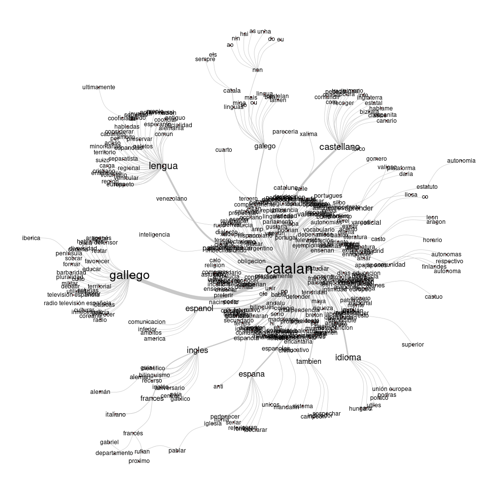{width="80%"}

**Lemarik atxikienak**

Taldeko lemarik adierazgarrienak, hots, $\chi^2$rik altuena dutenak taldearekiko, hauek dira:

1.  Catalan
2.  Gallego
3.  Galego
4.  Valenciano
5.  España
6.  Lengua
7.  Frances
8.  Inglés
9.  Español
10. Bable

Kasu guzti horietan gehienak talde honetan eman dira eta atxikitasuna estatistikoki adierazgarria da 0.001etik beherako errorearekin. Gizarte zientzietan 0.05 erabiltzen izan denez, nahiko eta sobera.

Bestelako ikuspegia har daiteke berba-laino irudiaren azterketan; horretan tamainak taldearekiko atxikitasuna adierazten du eta taldean izandako 5 gertalditik gorako kasuak barne hartzen dira. Ez da ordena informaziorik honetan.

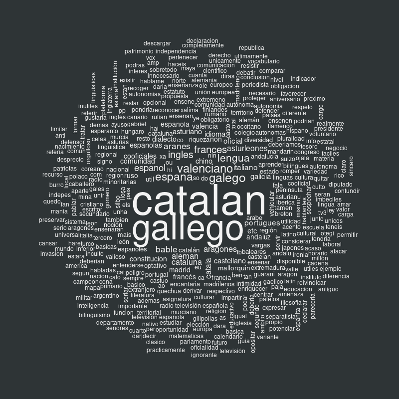{width="100%"}

**Testu laginak**

Segidako hamar laginotan ikus daitezke lehenengo 50 txio adierazgarrienen artean aukeratutako 10 adibide.

1

> ayer en la sexta columna ferreras presento un documental sobre las lenguas oficiales de espana castellano espanol gallego euskera y catalan el valenciano mallorqui bable y aranes y silbo gomero como dialectos
>
> -- \*produk_gitxi \*hizk_eues

2

> yo no entro en polemica es mas yo hablo castellano pero en espana hay mas lenguas oficiales por ejemplo el gallego el catalan el euskera etc tambien hay dialectos como puede ser el mayorquin y el valenciano un saludo yo no tengo estudios pero vivo en espana
>
> \*produk_behin \*hizk_es

3

> espanol idioma castellano lengua solo hay un idioma en espana el espanol hay varias lenguas minoritarias en espana valenciano catalan gallego euskera asturiano aranes hay una lengua comun el castellano
>
> -- \*produk_behin \*hizk_es

4

> a cada uno lo q le interesa el espanol es un idioma y espana tiene la riqueza d adaptar sus lenguas x ccaa mallorquin valenciano andaluz vasco asturiano gallego extremeno catalan a1q proto euskera es prestado del latin cambiando pronunciacion idioma yo si lo creo
>
> -- \*produk_behin \*hizk_es

5

> y lo bonito que seria aprender en el colegio una base que quien quisiera pudiera desarrollar de las lenguas cooficiales ingles frances aleman italiano chino todo correcto euskera gallego catalan aranes asalto al castellano ni nos conocemos ni nos queremos
>
> -- \*produk_behin \*hizk_es

6

> a mi parecer si creo q con el ingles y espanol hay suficiente para comunicarte con todo el mundo si es por aprender lenguas simplemente en espana tenemos lenguas como el gallego euskera catalan mayorquin valenciano
>
> -- \*produk_behin \*hizk_es

7

> primeramente el espanol como lengua no existe supongo que te refieres al castellano se consideran lenguas espanolas aquellas lenguas propias que se hablan en cualquiera de los territorios que conforman el reino de espana lease catalan valenciano gallego euskera y castellano
>
> -- \*produk_behin \*hizk_es

8

> mientras los hijos de todos nuestros dirigieres estudian en colegios donde el ingles frances aleman son las lenguas vehiculares a nuestros hijos les obligan a estudiar en lenguas minoritarias sin ningun futuro como el valenciano euskera gallego o catalan ese es el drama
>
> -- \*produk_behin \*hizk_es

9

> o de el idioma se nos esta yendo de las manos vamos a ver yo no quiero que se pierdan nuestras lenguas gallego catalan euskera valenciano bable pero necesitamos un lenguaje comun para entendernos yo prefiero que sea el espanol a que sea el ingles hablar espanol no modifica lo
>
> -- \*produk_gitxi \*hizk_es

10

> la pagina web de la policia espanola va a estar incluida en varios idiomas entre ellos el catalan euskera gallego y valenciano tambien va a estar disponible en ingles frances aleman e italiano me sorprende que no va a estar disponible en arabe
>
> -- \*produk_behin \*hizk_es

##### Bigarren taldea: *Espainiar egoera*

10575 txiok osatzen dute, corpusaren % 61.31

Talde honetan hego Euskal Herriko, gehienbat EAEko gaztelaniadunen hainbat eta hainbat txio ikusten dira, euskararen presentzia ez da bazterrekoa euren bizian, azterketan, Athleticeko jokalarien erabileran eta abar agertzen zaielako. Baina *agur*, *bihar arte*, *eskerrik asko* eta era horretako erabilerez gain ez da gehiegi ageri euren txioetan, sarri euskararen erabilera erasoen kontra defendatu arren.

Ideion eta argudioen nondik norakoari antzemateko antzekotasunen analisi grafikoa segidan:

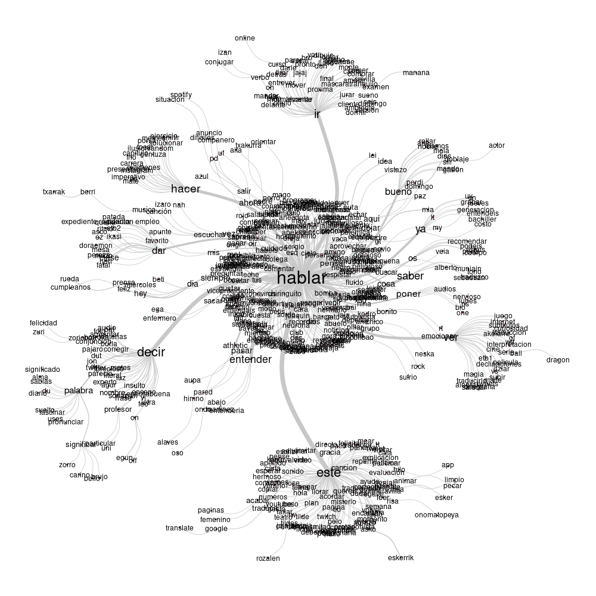{width="80%"}

**Lemarik atxikieenak:**

Aurreko irudion argudiatzeko bideak hurrengo lemon bitartez gauzatu da, hasieran lehenengo hamarrak zerrendatuta eta gero berba-laino formatuan adierazgarrienak.

1.  Jugador
2.  Palabra
3.  Athletic
4.  Ir
5.  Decir
6.  Traducir
7.  Entender
8.  Examen
9.  Rival
10. Madre

Zerrenda horretako 20.ak ere aipatzea merezi du: `XD` , hau da, 😀 hizkiz adierazia.

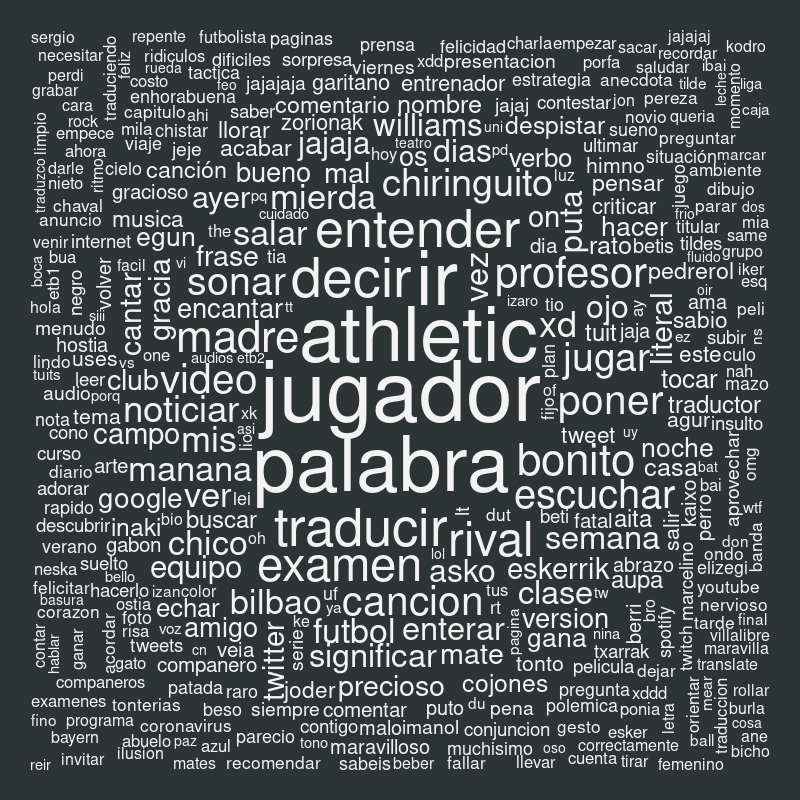{width="100%"}

**Testu laginak**

Ideiok irudikatzeko lehenengo ehunen arteko multzoko adibiderik onenetatik hamar adibide.

1

> una verguenza los jugadores que son vascos del athletic hablando en euskera y tienen un himno tambien en euskera pero que va ser lo proximo que lis ninos digan ama y aita ya estan los tanques yendo con el general ortega smith a bilbao y abascal en caballo y espadon
>
> -- \*produk_idazleenak \*hizk_es

2

> pues de eso va el hilo del tweet origen muchos jugadores del athletic hablan euskera en casa en lezama entre amigos tienen que cambiar en el campo para que se les entienda
>
> -- \*produk_behin \*hizk_es

3

> alentar a los ninos de euskadi a que escriban en euskera me parece una buena forma de promover su cultura tan rica como el resto de culturas de este pais ahora decirles que si no lo hacen el olentzero no va a entender sus cartas me parece de hijo de la gran puta
>
> -- \*produk_gitxi \*hizk_es

4

> bien en casa vamos conociendo mas palabras en euskera hoy ha tocado asteartea hace unos dias fue larunbata ahi vamos con los dias de la semana luego esta bihar gaur gracias a ver pelota en la eitb
>
> -- \*produk_behin \*hizk_es

5

> la ley se cumple si no lo tengo mal entendido a ver que entiendo lo que dices pero yo te digo que si yo voy al pais vasco y me encuentro muchas cosas en euskera mi pensamiento sera aprender lo antes posible y no ponerme a echar mierda sobre los lugarenos y su lengua
>
> -- \*produk_behin \*hizk_es

6

> wtf no cambies de tema de repente a ver que me digas que un examen de gramatica de euskera o analisis de oraciones no te van a servir para nada lo entiendo pero bro la historia puede ser tranquilamente de las asignaturas que mas te van a hacer conocer como es el mundo ns
>
> -- \*produk_erdikoak \*hizk_es

7

> ertzainen nazional elkartasuna hostia me roto la cabeza y el idioma quien cojones fue el ideologo que le puso el nombre joder si lo van a poner en euskera que lo hagan en euskera no mezclando palabras al tuntun vaya alicates
>
> -- \*produk_idazleenak \*hizk_eues

8

> dicen por ahi paso de citar tweet que que mal ensenar mates en euskera y tienen razon que luego nos ponemos a contar en euskera que en cast no sabemos bueno y en euskera dicen que nos inventamos las palabras asi que todo mal y acabamos invocando a cthulhu cuando no toca
>
> -- \*produk_erdikoak \*hizk_es

9

> estoy hablando con una que cuando hablo en euskera mi profesor no me entiende porque es un euskera diferente del que habla el y va y me dice la chica que ella muchas veces no me entiende tampoco help pls
>
> -- \*produk_behin \*hizk_es

10

> en ocasiones anteriores hemos visto como nombres de marcas o palabras en euskera estan en nuestro dia a dia las conocemos y convivimos con ellas hoy vamos a verlo a traves de los grupos de musica de los que hemos venido hablando en los ultimos dias
>
> -- \*produk_idazleenak \*hizk_eues

Adibide horiek aukeratzeko orduan ikusi da lehenego berrogeita hamarretan nekez aurkitzen dela Chiringuito telebistako programan Athleticeko jokalariek euskara erabili izana aipatzearen ingurukoa ez denik.

##### Hirugarren taldea: *Izan ala zer izan, Na[v\|f]arr(o)a*

3603 txiok osatzen dute, corpusaren % 20.89

Talde honetako gairik nabarmenena Nafarroa da. Nafarroa Euskal Herria den ala ez, euskal herririk baden, euskara Nafarrokoa den, nafartasunaren euskaltasuna... batez ere identitatearen inguruan dihardu gaiak.

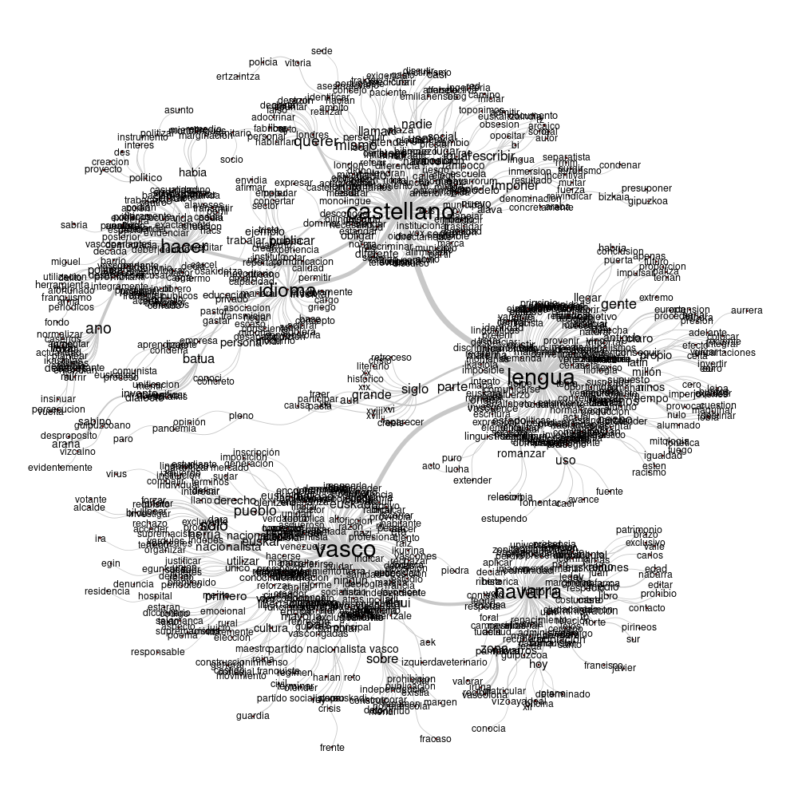{width="80%"}

**Lemarik atxikieenak:**

1.  Navarra
2.  Siglo
3.  Pueblo
4.  Euskal
5.  Herria
6.  Zona
7.  Batua
8.  Nacionalista
9.  Imponer
10. Reino

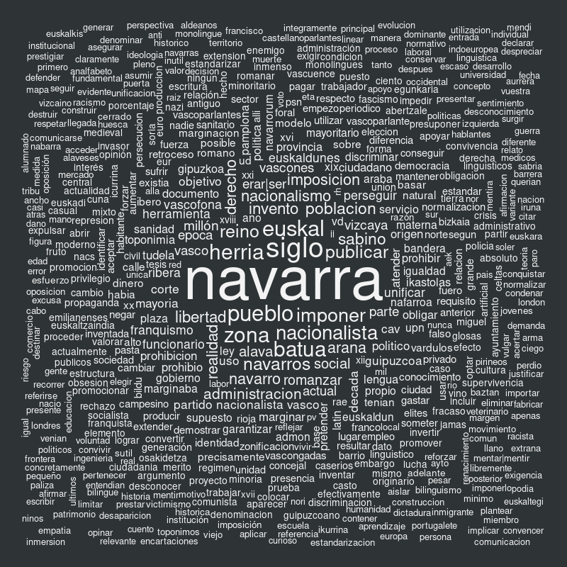{width="100%"}

**Testu laginak**

1

> lo que hace el desconocimiento euskal herria significa el pais del euskera aparece ya en las escrituras en el siglo xv cuando aun existia el reino de navarra historico navarra historica ocupando parte de aragon euskadi actual y el iparralde pais vasco frances
>
> -- \*produk_gitxi \*hizk_es

2

> se extiende muy sutilmente por lo que veo en la provincia de alava gran parte de vizcaya y en toda navarra de pamplona para abajo no habla euskera ni dios y si no fuera por el chorreo de millones y de subvens lo hablaria tanta gente como en albacete pero son euskal herria
>
> -- \*produk_gitxi \*hizk_es

3

> tu ideologia se basa en que por razones etnicas el euskera y la cultura comun navarra no es una nacion sino parte de otra que llamais euskal herria y que por cierto extendeis a zonas donde no hay ni euskera ni cultura vasca
>
> -- \*produk_esajerau \*hizk_es

4

> tropa tropa vosotros hay navarrisimos que respetamos el euskera euskal herria solo existe en la mente de los nazionalistas vascos y de sus infiltrados en navarra que no haceis otra cosa que tocar bien los cojones a la mayoria del pueblo de navarra
>
> -- \*produk_behin \*hizk_es

5

> y despues se permitio pero no tienes explicacion de por que en las castellanas guipuzcoa y vizcaya no comenzase el retroceso hasta el siglo xix o que tenian tasas mas altas de euskaldunes no podemos entonces hablar dediferencias respecto al euskera en navarra y castilla
>
> -- \*produk_esajerau \*hizk_eues

6

> yo creo que ud no puede ignorar la realidad de que el euskera se habla en navarra ergo es navarro y se ha hablado mucho mas en el pasado reciente y en el lejano solo en el siglo xx hemos visto fallecer a los ultimos hablantes de la variedad propia de roncal y salazar y
>
> -- \*produk_esajerau \*hizk_es

7

> es mas dificil porque si eres de la ribera navarra no tienes ni la opcion a matricularte en la educacion publica en modelo d en tu pueblo o en el mas cercano por que no te dejan porque no se respetan los derechos linguisticos profesores que sepan euskera hoy en dia hay de sobra
>
> -- \*produk_erdikoak \*hizk_es

8

> la euskal selekzioa no es solo el pais vasco se usa el termino euskal selekzioa y no euskadi selekzioa xq abarcamos navarra y el pais vasco frances tb por mucho k joda a los fachitas e ineptos se habla euskera en las 7 provincias de euskal herria
>
> -- \*produk_behin \*hizk_es

9


> el paleto inutil y obsesionado dentro y fuera de cualquier zona francofona anglofona o vascofona eres tu el euskera es el idioma de decenas de generaciones en navarra millones de navarros a lo largo de su historia y sigue siendolo para decenas de miles de navarras y navarros
>
> -- \*produk_idazleenak \*hizk_es


10

> los que poneis vascongadas que sepais que en euskera es euskal herria tierras vascas que incluye euskadi navarra euskadi ccaa
>
> -- \*produk_behin \*hizk_es


# Ondorioak

## *Euskera* gaztelaniaz begiratuta

Hamaika teknika eta ikuskeratatik aztertu zitekeen erabili den corpusa. Gure kasuan, aukeratu dugun ikuskera sailkapen automatikokoa izan da eta corpusa osatu dugu eskuragai egon diren txio guztiekin; uste izatekoa da bestelako irizpideek bestelako emaitzak sor zitezkeela (eta hau lar ez luzatzearren erakutsi gabeko bestelako azterketek hala erakutsi digute). Azterketa xeheagoek Twitterren garatu diren eztabaida batzuk bana zitzakeen, esate baterako.

Txiolarien jardunaren ikuskeratik begiratuta, ematen du neurri bateraino txiolariak zenbat eta gehiago txiokatzen duen era bateko edo bestelako joerak hartzen direla, norabide koherentean zabaltzen direnak. Baina puntu batetik aurrera, ordea beste era bateko diskurtsu erabiltzeko joera ere badago. Txiolari horiek dira 50 txio baino gehiagotan euskara aipatu dutenak.

Txiokatzeko hizkuntzen araberako hasierako irizpidetik ez dugu jaso emaitza adierazgarririk

Euskararen inguruan hiru gune nagusi aurkitu ditugu gaztelaniazko diskurtsuetan Twitterren 2020an:

-   Espainia zelakoa den edo izan behar lukeen

-   Euskarak (gaztelaniazko) gizartean duen edo ez duen tokia

-   Identitate eraikuntza, batez ere euskara eta nafar identitatearen eraikuntza eta eztabaida. Talde honetan jarduten dute, gehienbat, euskara gaitzat hartuta ari izaten diren txiolari emankorrenek.

Hasierako antzekotasunen analisiak ez digu erakutsi diskurtsu egituraz informaziorik apenas. Reinerten araberako sailkapena eginda, berriz, egitura logikoen gaineko informazio argigarria azaleratu da antzekotasun analisietan.

## Mugak

Aldagaien aukeraketa eta zehaztapena ez da izan zuzena hizkuntzaren ingurukoa, *euskera* hitza hartu dugu aztergai, baina oso litekeena da erabiltzaile askok euskarazko txioak idatzi arren *euskera* ez erabiltzea horietan, eta are gutxiago ingelesez, nahiz eta gaia aipatu. Edo beste hamaika gaien inguruan ere txiokatu zezakeen txiolari horrek, euskararik aipatu ere egin barik.

Oso litekeena da eraikuntza oker horrek eragitea aldagaiaren eragin-ezari.

## Ikuskera teknikoan

R sistema erabiltzeko interfacea den neurrian, proiekzio batzuk egiteko informazio adierazgarria ikus liteke *biplot* izeneko grafikoak sortuko balitu, edota norberak sortzeko bidea erraz baleude.

Nahiz eta fitxategi guztiak bistan uzten dituen, egindako analisi guztien fitxategi guztiak arakatu daitezke-eta, horien edukia ez da gardena. Dokumentazio eta foroetan azterka ibiltzera derrigortzen dute erabiltzailea.

#### Euskara

IRaMuTeQ-en oinarrizko instalazioan gaur iterfacea frantsesez, ingelesez, portugesez, gaztelaniaz eta italieraz eskaintzen da. Analisirako ere hizkuntza horietako hiztegiak ditu; horiei gehitu behar zaizkie beste hiru, [webgunean eskura daitezkeenak](http://www.iramuteq.org/dictionnaires), nederlandera, norvegiera bat eta greziera.

Euskal inguruan lanerako tresnatzat euskaraz erabiltzeko hutsunea dugu, euskaraz sortutako testuen azterketarako.

Hori sortzeko ahaleginari ekin behar diot, hurrengo posten batean komentatuko dut.

# Erreferentziak

Poldi, Fracesco, & Zacharias, Cody. (2021). *TWINT - Twitter Intelligence Tool* (Version 2) [Python]. TWINT Project. <https://github.com/twintproject/twint> (Original work published 2017)

Ratinaud, Pierre. (2014). *IRaMuTeQ: Interface de R pour les Analyses Multidimensionnelles de Textes et de Questionnaires* [Linux]. <http://www.iramuteq.org>

Reinert, A. (1983). Une méthode de classification descendante hiérarchique: Application à l'analyse lexicale par contexte. *Les cahiers de l'analyse des données*, *8*(2), 187--198.
