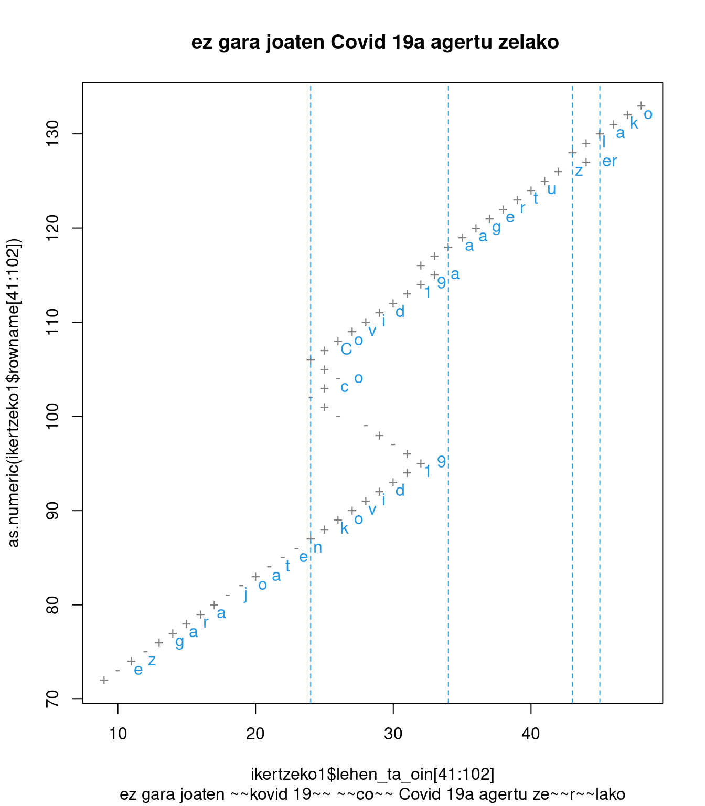
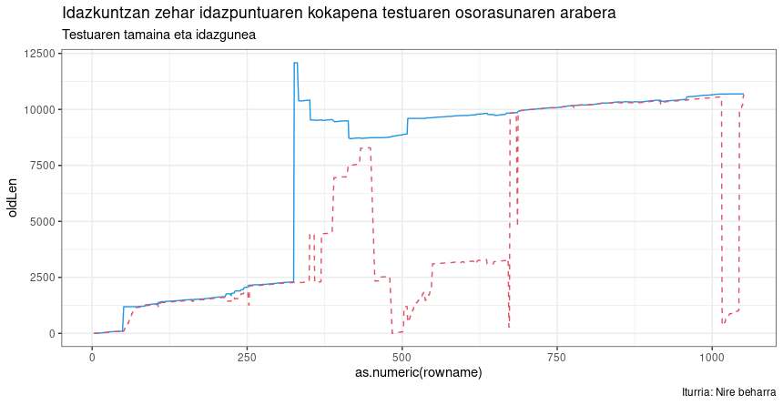
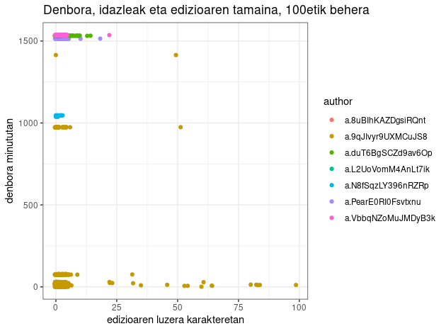
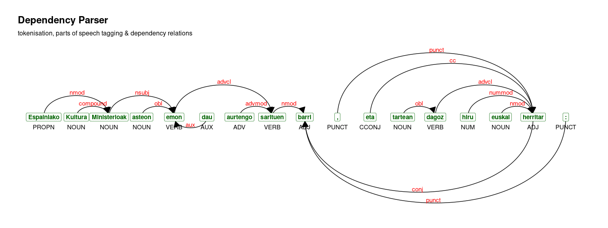
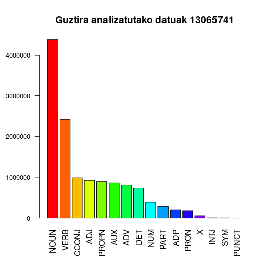
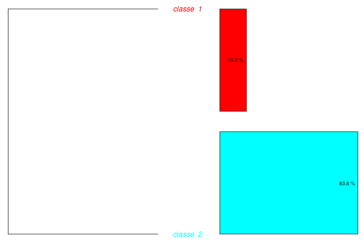

Urteak burua jo behar du laster batean eta hemengo honetan eskuartekorik ezer gutxi erakutsi dudanez, bat edo batzuk mahaigaineratuko ditut, nondik norakoaz hausnartze-ariketa legez.

Zenbait kontutan ikerketa taldeak naraman arren, ez dut gehiago sakondu egin beharrekoa baino,bhoriek denak bazter utzita, eskuartekoak eta stand-by ditudan hiru kontu:

+ IDAT, Idazketa Aztertzeko Tresna doitzea kodean eta performancean
+ IRaMuTeQ-erako euskarazko hiztegia
+ Azterketen azterketak

# IDAT berridatzi eta aurrera pausuren bat

Kodea berridazteari ekin diot aurten, batez ere R lengoaiko *tidy* filosofiara egokitzeko. 
Hori eginaz, idazle bakarreko testuetako  idazketa prozesua irudikatzea ere lortu dut.

Esate baterako: 



> *ez gara joaten ~~kovid 19~~ ~~co~~ Covid 19 agertu ze~~r~~lako*

Goiko testu horretan ume batek pandemiaren eraginaz idazten duen tartean egiten dituen zuzenketa ortografikoak ikusten dira.

Testuratze prozesu osoaren ikuskera ere lortu dut, baina baliteke argiegia ez izatea interpretazio bidea



Goiko irudi horretan marra urdinak adierazten du testu osoaren luzera zein den karakteretan, marra gorriak, berriz, adierazten du idazketan ari dena non den ari, zenbatgarren karakterean. Beraz, antzeman daiteke nola oratzen dion testuari

Amaitzeko, denbora, idazle bakoitzaren ekarpenaren tamaina erakuts ditzakeen beste grafiko bat lortu dut (argi eta garbi egokitu beharrekoa).



Horretan argi dago dokumentuaren prestakuntza marroi argiz irudikatutako egileak egin duela. Ematen du oinarrizko testu bat prestatu duela geroko lanketarako. Testu horretan hasierako ekarpen batzuk berak idatzi eta erredaktatuta egin dituela erakusten du ezkerreko puntu marroien beheko multzuak. Baina beherengo lerroan ere ikusten dira zenbait testu luze itsatsi eta inkatzea (beheko lerroetan eskumarantz ikusten diren puntu sakabanatuetan). Aurrerago, 1000. minutuaren inguruan ere ikusten da urdin argiz identifikatutako egileak ekarpen batzuk egiten dituela. Amaierarantz, 1500. minututik aurrera talde batek parte hartzen duela ematen du, hor edizio labur asko agertzen baitira.

Beste ezaugarriren bat ere destilatu dut... baina botila bete arte, ontzen utzi behar gehiago erakutsi gabe. Hori gertatu bitartean, oraintxe eskuartean darabildan beste bati begiratuko diot:

# Euskarazko hiztegiaren eraikuntza IRaMuTeQ-en erabiltzeko

Laguntza eske ibili naiz han eta hemen eraikuntza eta balidatze prozesuan. Antza erakargarri izan daitekeela-eta horren barri Europan emateko gonbidapena jaso dut Okzitaniako Tolosatik, nora eta Napolira kontatzera joateko!

## Buruhausteetatik aurrera

1. Beste hiztegiak egiteko erabili diren sistemak euskararekin ez du balio.
2. Euskararen aldakortasun handia euskara batuan bertan (Berriako batua, gure ikasleen batua, Herria aldizkariko batua...)
3. Beste hiztegiek eta nire euskarazko hiztegiak antzera dabiltzan aztertu behar da.

Beste hiztegiak sortzeko `TreeTagger` erabili izan da, baina euskaraz erabiltzeko ez dago prest. Itxuroso-edo ibiltzen da `udpipe`, baina sailean eta corpus handiarekin erabilita, hainbat huts aurkitzen dira.

{width=95%}

Kalitate horrekin (euskeraz lor dezakedanik onena) hiru corpus analizatu ditut; betiere euskara batutzat har daitezkeen formak jasota:

+ ematen
+ emoten
+ emaiten

Aurreko formak jaso nahi izan ditut, baina ez hurrengoak:

+ Etxea
+ Etxi
+ Etxie

Azkenean, lehenengo datu multzo handia lortuta, lehenengo hiztegitxoa lortu dut:

{width=85%}

Orain horixe aztertzen hasita nago. Ikasleek idatzitako kritikekin interesgarri... baina niri egindakoak direnez, zientzia egiteko egokiak baino psikoanalistagaz erabiltzeko egokiagoak lirateke.

Azkenean argi ikusi dut zerekin landu: corpus paraleloak erabilita.

Itxi aurretik, bidean.net webgunean eguneroko Ebanjelioaren hiru eredu eskaintzen izan dituzte: euskara batuzkoa, mendebaldeko bizkaiera jasozkoa eta gaztelaniazkoa. 
Horixe izan da nire lehenengo aztergai zientifikoa... edo horranzko pausua, behinik behin.

### Azterketa elebidun paraleloa

Hona Reinert metodoa erabilita, euskara batuan lortutakoaren lagin txikitxu bat:

{width=45%}

Eta hauek, bertako taldeen ezaugarriak batzen dituzten testuak:

```text
**** *ebanjelaria_Mateo *egutegia_UrteanZehar *zein_Mateo17-22-27 *3924_3935
score : 7538.08
aldi hartan ikasleak jesusekin galilean zebiltzala jesusek honela esan zien

**** *ebanjelaria_Markos *egutegia_UrteanZehar *zein_Markos8-34-9-1 *3302_3307
score : 7335.63
aldi hartan jesusek jendea eta ikasleak batera deiturik honela esan zien

**** *ebanjelaria_Lukas *egutegia_UrteanZehar *zein_Lukas6-20-26 *2348_2351
score : 7219.86
aldi artan jesusek ikasleengana begiak jasorik honela esan zien

**** *ebanjelaria_Mateo *egutegia_GarizumakoA *zein_Mateo7-7-12 *4604_4616
score : 7204.31
aldi hartan jesusek honela esan zien bere ikasleei

**** *ebanjelaria_Mateo *egutegia_UrteanZehar *zein_Mateo7-612-14 *4599_4611
score : 7204.31
aldi hartan jesusek honela esan zien bere ikasleei

**** *ebanjelaria_Mateo *egutegia_Abendualdik *zein_Mateo7-2124-27 *4591_4603
score : 7204.31
aldi hartan jesusek honela esan zien bere ikasleei

**** *ebanjelaria_Mateo *egutegia_UrteanZehar *zein_Mateo7-21-29 *4580_4592
score : 7204.31
aldi hartan jesusek honela esan zien bere ikasleei

**** *ebanjelaria_Mateo *egutegia_UrteanZehar *zein_Mateo7-15-20 *4574_4586
score : 7204.31
aldi hartan jesusek honela esan zien bere ikasleei
```

... eta horrela segitzen du lehenengo multzo horrek.

Eta gaztelaniaz hauxe aurkitu da:

{width=45%}

Eta hurrengook dira ezaugarritzen duten lehenengo testuak:

```text
**** *ebanjelaria_Marcos *egutegia_SemanaDelTi *zein_Marcos7-1-13 *3136_3155
score : 3338.04
en aquel tiempo se acercó a jesús un grupo de fariseos con algunos letrados de jerusalén y vieron que algunos discípulos comían con manos impuras es decir sin lavarse las manos

**** *ebanjelaria_Marcos *egutegia_SemanaDelTi *zein_Marcos11-27-33 *2720_2736
score : 3314.56
en aquel tiempo jesús y los discípulos volvieron a jerusalén y mientras paseaba por el templo se le acercaron los sumos sacerdotes los letrados y los senadores y le preguntaron

**** *ebanjelaria_Marcos *egutegia_SemanaDelTi *zein_Marcos7-1-814-1521-23 *3150_3169
score : 3298.20
en aquel tiempo se acercó a jesús un grupo de fariseos con algunos escribas de jerusalén y vieron que algunos discípulos comían con manos impuras es decir sin lavarse las manos

**** *ebanjelaria_Mateo *egutegia_SemanaDelTi *zein_Mateo17-22-27 *3874_3898
score : 3097.76
en aquel tiempo mientras jesús y los discípulos recorrían juntos la galilea les dijo jesús

**** *ebanjelaria_Marcos *egutegia_SemanaDelTi *zein_Marcos8-34-9-1 *3246_3265
score : 3056.84
en aquel tiempo jesús llamó a la gente y a sus discípulos y les dijo

**** *ebanjelaria_Mateo *egutegia_SemanaDelTi *zein_Mateo18-1-51012-14 *3890_3914
score : 3048.88
en aquel tiempo se acercaron los discípulos a jesús y le preguntaron

**** *ebanjelaria_Mateo *egutegia_SemanaDelTi *zein_Mateo18-1-510 *3883_3907
score : 3048.88
en aquel tiempo se acercaron los discípulos a jesús y le preguntaron

**** *ebanjelaria_Mateo *egutegia_SemanaDelTi *zein_Mateo13-10-17 *3595_361
score : 3048.88
en aquel tiempo se acercaron a jesús los discípulos y le preguntaron

**** *ebanjelaria_Mateo *egutegia_SemanaDeCua *zein_Mateo23-1-12 *4146_4173
score : 3045.18
en aquel tiempo jesús habló a la gente y a sus discípulos diciendo

**** *ebanjelaria_Juan *egutegia_TiempoDeNav *zein_Juan1-35-42 *35_35
score : 3014.54
en aquel tiempo estaba juan con dos de sus discípulos y fijándose en jesús que pasaba dice
```

Gainetik begiratuta, behintzat, bide okerrekoegitik ez du ematen nabilenik... baina bai zer aztertu dagoena. Bietan multzo bi baino ez ditu batzen :-( Baina antzerako emaitzak lortzen ditu :-D ...baina tamaina nahiko desberdinak, gaztelaniazkoak corpusaren ia bikoitza jasotzen du.

**Hurrengo egitekoa**: Ebanjelioak ez diren bestelako corpus paraleloa sortu, ahaleginez gaztelaniaz baino, frantsesez; eta azterketa testualean ardaztu baino, etiketa bertsuak erabili behar dira azken emaitzak alderatzeko.

...eta hori guztiori 2022an izan beharko.
