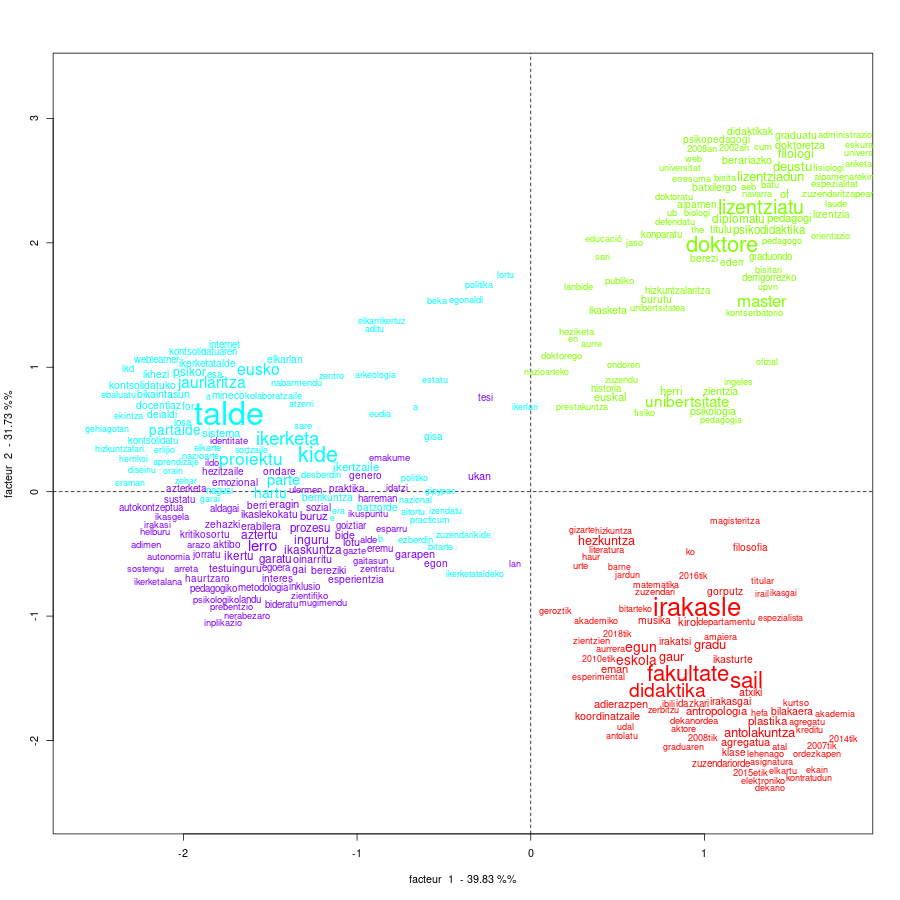

```{r echo=FALSE, message=FALSE}
library(tidyverse)
```

**...edo _Iramuteq euskaraz erabiltzen hasita_**

Lehengo astean aurkeztu genuen, azkenik, Iramuteq-erako euskarazko lexikoa (post honen amaieran daude diapositibak). Horren aitzakiaz, aurkezpen horretan erakutsi genuen analisi bat aztergai dakargu hona. Sakonxeago, ez sakonegi. Zelan edo halan esateko, emaitzaren lau alderdi nagusietan dimentsio bat azaltzen da hemendik haurrera:

Honela egituratu dut testua: hasieran metodologiaz ohartxuren bat; gero, corpusaren deskribapena; hurrengo, tartea egindako sailkapenaren laburpena, emaitzen lagin batzuekin, klaseko mota bat, sailkapenaren azpi atalaren bukaeran ezaugarri kualitatiboen banaketa ere azaltzen da; azken atalean aurkitutako muga batzuk aipatzen dira eta erreferentziak. Eranskintzat, lehengo eguneko aurkezpena

_**Irakurle!** Begira zer agertu den corpus hau aztertuta!_

## Metodologiaz

Corpusa aztertzeko [Iramuteq^[*Interface de R pour l'Analyse Multidimentionel des Textes et Questionaires*; hots, testu eta galdetegien dimentsio anitzeko analisia egiteko Rrako interface-a]](http://www.iramuteq.org/) (Ratinaud, 2009) erabili dugu, Beheranzko Sailkatze Hierarkikoa erabilita (CHD, *Classification Hierarchique Descendante*). 

Oinarrizko hipotesia hau da: corpusaren baitako diskurtsoa matematikoki modeliza daitekeela. Corpusa esanahi-unitateetan bana daitekeela eta unitate horretako elementu lexikal bakoitzak bere testuinguruak definitzen duela. Horra iritsita, testuinguru klaseak identifika litezke, lexiko jakin batek zehaztuta; baldin eta unitateen (esaldien) elementuak (lexikoa) taldekatzen baditugu.

*Zelan taldekatu, baina?* Horra On Reinerten ekarpena: dimentsio anitzeko teknikak erabilita: gorago aipatutako CHD hori; oinarritzat presentzia/absentzia matrize erraldoia du, zutabeetan lexiko unitate bakoitza eta lerroetan testu unitate bakoitza.

`r emo::ji("question")` `r emo::ji("meh")`

### Corpusa 

**Corpus bat**ek diskurtso baten hegal batzuk osatuko duelako ustean, corpus bat batu behar da: UPV/EHUko Haur Hezkuntzako Graduan eta Lehen Hezkuntzako Graduan eskolak ematen dituztenek euren burua unibertsitatearen aurrean azaltzeko idatzitakoa.

UPV/EHUko Haur Hezkuntza edo Lehen Hezkuntza graduetan klaseak ematen ditugunoi pasa den urtean eskatu ziguten gure azalpen fitxa bat osatzea. [Hemen](https://www.ehu.eus/eu/lehen-hezkuntzako-gradua-bizkaia/irakasleak?p_redirect=fichaPDI&p_idp=351472) nirea `r emo::ji('silence')`

```{r corpusa, echo=FALSE}
knitr::kable(data.frame(Bilbo = c(116, 80), 
                        Donostia = c(90, 47), 
                        Gasteiz = c(92, 44),
                        row.names = c('denera', 'deskribatuak')),
            caption = 'Irakasleria hezkuntza formaleko graduetan') %>%
  kableExtra::kable_styling(position = "center")
```

Aurreko taula horretan ikusten da irakasle guztiok ez dugula bete eskatutako hori, baina erdiak baino gehiago egin duenez, nahikotzat hartu beharko.

Denera irakasle eta ikertzaile kontratua duten UPV/EHUko 171 deskribapen hartu eta Iramuteq horri eskatu diogu corpus horren barruan dauden *ikuskerak* identifikatzea. Zehatzago eta hobeto esanda, eskatu diogu lexikoaren erabileraren araberako sailkapena egitea.

## Sailkapena

Hona lehenengo sailkapena, Reinertek asmatutako ALCESTE metodoa erabilita (Reinert, 1990).

{width=100%}

Eta hori `r emo::ji('up')` zelan interpretatu behar da?

Ba, lexiko multzo bakoitzak berori erabilita iradokitzen den mundu-lexikal bati buruz egiten digu berba. Horrela, gorriz agertzen denak gure irakaskuntza-alderdiaz idatzi dugunari buruz dirautsagula ematen du. 
Izan ere, hor ditugun hitz batzuk beste multzoetan baino nabarmen gehiago agertzen dira multzo horretan. Atxikipen horren balio kuantitatibotzat Iramuteqek ematen dizkigu $\chi^2$aren balioa eta horri dagokion p-balioa.

### Lehenengo klaseaz... eta lexiko adierazgarria

Segidan lehenengo eremu edo klase horri dagozkion hitzak aurkezten ditugu gordinik, hau da, garbiketarik egin gabe.

```{r lehenengokoBerbak, echo=FALSE}
structure(list(ji_karratua = c(255.255, 207.802, 203.69, 161.341, 
                               81.522, 75.913, 67.003, 66.599, 63.52, 59.8, 44.245, 43.342, 
                               38.005, 37.845, 37.502, 36.221, 32.264, 31.272, 30.073, 28.57, 
                               26.756, 26.302, 26.237, 24.973, 21.55, 19.705, 17.499, 15.981, 
                               13.971, 13.1, 13.1, 12.556, 12.55, 12.187, 10.906, 10.906, 10.902, 
                               10.456, 10.127, 10.124, 8.734, 8.717, 8.717, 8.717, 8.717, 8.717, 
                               8.717, 8.717, 8.717, 8.717, 7.648, 7.498, 7.498, 7.498, 7.498, 
                               7.213, 7.053, 6.937, 6.532, 6.532, 6.532, 6.532, 6.532, 6.532, 
                               6.532, 6.532, 6.143, 5.958, 5.197, 4.097), lema = c("irakasle", 
                                                                                   "sail", "fakultate", "didaktika", "egun", "eskola", "antolakuntza", 
                                                                                   "gradu", "gaur", "hezkuntza", "plastika", "antropologia", "eman", 
                                                                                   "kirol", "agregatua", "adierazpen", "atxiki", "koordinatzaile", 
                                                                                   "irakasgai", "bilakaera", "gorputz", "ikasturte", "musika", "irakatsi", 
                                                                                   "filosofia", "klase", "zuzendariorde", "idazkari", "zuzendari", 
                                                                                   "dekanordea", "atal", "departamentu", "literatura", "urte", "agregatu", 
                                                                                   "2015etik", "zientzien", "aurrera", "geroztik", "haur", "titular", 
                                                                                   "kurtso", "elkartu", "asignatura", "ordezkapen", "lehenago", 
                                                                                   "elektroniko", "aktore", "2008tik", "2007tik", "magisteritza", 
                                                                                   "udal", "antolatu", "zerbitzu", "ibili", "akademiko", "amaiera", 
                                                                                   "esperimental", "graduaren", "kreditu", "kontratudun", "hefa", 
                                                                                   "ekain", "dekano", "akademia", "2014tik", "jardun", "matematika", 
                                                                                   "lan", "gizarte"), p.balioa = c(1.857082e-57, 4.14385e-47, 3.270538e-46, 
                                                                                                                   5.764138e-37, 1.733056e-19, 2.964277e-18, 2.711516e-16, 3.326898e-16, 
                                                                                                                   1.587643e-15, 1.04985e-14, 2.897448e-11, 4.596249e-11, 7.055477e-10, 
                                                                                                                   7.660656e-10, 9.133788e-10, 1.761901e-09, 1.345795e-08, 2.242641e-08, 
                                                                                                                   4.16087e-08, 9.038635e-08, 2.307833e-07, 2.919777e-07, 3.020472e-07, 
                                                                                                                   5.813452e-07, 3.446788e-06, 9.037439e-06, 2.874654e-05, 6.399638e-05, 
                                                                                                                   0.000185684, 0.0002953489, 0.0002953489, 0.0003949289, 0.0003961702, 
                                                                                                                   0.0004813333, 0.0009584378, 0.0009584378, 0.0009606614, 0.001222464, 
                                                                                                                   0.001460818, 0.001463758, 0.003122627, 0.003152909, 0.003152909, 
                                                                                                                   0.003152909, 0.003152909, 0.003152909, 0.003152909, 0.003152909, 
                                                                                                                   0.003152909, 0.003152909, 0.005683338, 0.006176192, 0.006176192, 
                                                                                                                   0.006176192, 0.006176192, 0.007237648, 0.007914606, 0.008441209, 
                                                                                                                   0.01059804, 0.01059804, 0.01059804, 0.01059804, 0.01059804, 0.01059804, 
                                                                                                                   0.01059804, 0.01059804, 0.01319187, 0.01465355, 0.02262267, 0.0429553
                                                                                   )), class = "data.frame", row.names = c(NA, -70L)) %>% 
  select(lema, ji_karratua, p.balioa) %>% 
  knitr::kable(digits = 3, 
               caption = 'Lehenengo klaseko lemak') %>%
  kableExtra::kable_styling(position = "center")

```

Bistan da lexiko horrek lan egoeraz eta dozentziaz hitz egiten digula; baina zerrenda horretan badira elementu batzuk arrotzak ere ematen dutenak; deigarri egiten dira hurrengoak, behinik behin: urteak, *lehenago*, *eman*, *ibili*...

### Bigarren klaseaz... eta testu adibideak

Laburki esan dezakegu dendrograma azpiko berbba zerrendak ikusita bigarren eremua, berdezko agertzen dena, formakuntzari dagokiola. Berbok horri buruz ari dira:
*doktore, lizentziatu, master, unibertsitate, lizentziadun, deustu, filologi, diplomatu, psikodidaktika, pedagogi, herri, euskal, **of**, zientzia, doktoretza, berariazko, psikologia, ikasketa, graduatu...*

Berba zerrendez gain, corpusean esaldirik adierazgarrienak ere aurkitzen ditu, lexikoan oinarrituta beti ere. Bigarren eremu honekin segituta, hauek dira lehenengo laurak, letra lodiak Iramuteqek markatuak, letra etzana nirea:

> __pedagogian lizentziatua__ naiz __pedagogia__ terapeutikoko espezialitatea upv ehu 1996 __psikopedagogian lizentziatua__ upv ehu 2002 haur hezkuntzan __diplomatua__ mondragon __unibertsitatean__ 2008 sexologian aditua alcalako __unibertsitatean__ 2005 __psikodidaktika__ eta hezkuntzaren __psikologian masterra__ dut 2010 eta __psikodidaktikan__ __doktorea__ naiz __nazioarteko aipamenarekin__ 2015

> filosofia eta hezkuntza __zientzietan lizentziatua__ hezkuntza __berezian__ eta __orientazio__ espezialitateetan 1989 salamanca __unibertsitatean__ eta __pedagogia doktorea__ eta 1998 y __master en educación__ especial 1991 deustobilbao __unibertsitatean__

> __psikologian lizentziatua__ da __deustuko unibertsitatean__ 1998 __psikopedagogian lizentziatua__ uneden 2004 eta __psikologian doktorea euskal herriko unibertsitatean__ upv ehu 2002

> _Urlia Abizenduna_ 1972 __euskal filologian lizentziatua__ da eta __euskal herriko unibertsitatean__ literatura konparatuan eta literatur __ikasketetan doktorea__

### Hirugarren eta laugarren klaseak... eta planoan irudikatzea

Besteak beste, beste bi ere sumatzen dira, antzerako diskurtsoaz berba egiteko modu desberdinak.

Beste eremu bi ere identifikatu ditu eta interesekoa da ikustea nola banatzen dituen lema hauen agerrera dimentsio bitan:

{width=100%}

Goiko grafiko horrek islatzen du corpusaren %78ko aldakortasuna, hor gorriz eta berdez behe eta goi agertzen dira azaldutako klaseok, biak eskumako alderdian.

Ezkerrean multzo bakar baten moduan ikusten dira ikerkuntzarekin lotutako lemak. Horien hurbileko azterketak erakusten ditu ikerkuntzaren alderdi kontrajarri bi: ikertzailea eta bere taldea eta ikertzailea eta ikertua. Hirugarren klasea urdin argiz eta laugarrena morez

Taldeez: 

> 2011 eta 2019 bitartean ias research centre for life mind and society ikerketa taldeko kide izan da bertan eusko jaurlaritzak eta minecok finantzatutako ikerketa proiektuetan parte hartu duelarik


Eta ikertuaz:

> ikastegiko kudeaketa karguetan erakutsitako inplikazioak eta esperientziak azken urteotako ikerketa lana metodologia aktiboen erabileraren zentratzea ekarri du eta bereziki pentsamendu kritikoaren ikerketa lerroak jorratzea

#### ... eta berba-hodeia

{width=80%}


#### ... eta antiprofilak

Beste kontu batzuen berri ere ematen digu CHD analisiak; *antiprofilak*. 

Laugarren klasetik aldendu barik, azterketa lexikoaren beste ezaugarri bat nabarmenduko dugu.  
  Koka gaitezen: Azterketa lexikoak klaseen osagaiak zehazten ditu, hori esanda egon da. Paraleloki, corpusean agertu bai baina klasean ez agertzeko joera duten elementuak ere zehazten ditu. Zerrenda horretan 4. klasean hurrengoak ez agertzeko joera dute:

```{r antiprofila, echo=FALSE}
structure(list(lema = c("unibertsitate", "irakasle", "sail", 
"fakultate", "master", "lizentziatu", "doktore", "kide", "didaktika", 
"talde", "psikologia", "gradu", "euskal", "filosofia", "herri", 
"antolakuntza", "zientzia", "jaurlaritza", "lizentziadun", "eusko", 
"deustu", "koordinatzaile", "egun", "psikodidaktika", "magisteritza", 
"atxiki", "plastika", "kirol", "filologi", "diplomatu", "antropologia", 
"gaur", "pedagogi", "agregatua", "zuzendari", "of", "gorputz", 
"departamentu", "bilakaera", "batzorde", "ikerlari", "ederr", 
"ingeles", "lortu", "doktoretza", "titular", "teoria", "derrigorrezko", 
"berariazko", "en", "nazioarteko"), ji_kar = c(-68.131, -49.908, 
-45.944, -38.79, -28.036, -24.258, -23.972, -21.5, -21.091, -15.21, 
-14.882, -13.31, -12.415, -12.362, -12.075, -11.187, -10.695, 
-8.519, -8.519, -8.519, -8.519, -8.141, -8.089, -7.387, -7.387, 
-7.387, -7.387, -7.072, -7.011, -7.011, -6.698, -6.645, -6.261, 
-6.261, -5.597, -5.514, -5.348, -4.77, -4.77, -4.399, -4.399, 
-4.399, -4.154, -4.029, -4.029, -4.029, -4.029, -4.029, -4.029, 
-3.86, -3.86), p.balioa = c(1.529513e-16, 1.611303e-12, 1.216513e-11, 
4.718981e-10, 1.190512e-07, 8.425019e-07, 9.773571e-07, 3.537588e-06, 
4.380915e-06, 9.619615e-05, 0.0001144532, 0.0002639649, 0.0004260053, 
0.0004380611, 0.0005110032, 0.000823852, 0.001074437, 0.003513781, 
0.003513781, 0.003513781, 0.003513781, 0.004326913, 0.004452552, 
0.006569267, 0.006569267, 0.006569267, 0.006569267, 0.007829305, 
0.008100515, 0.008100515, 0.009653486, 0.009944485, 0.01234074, 
0.01234074, 0.01799116, 0.01886265, 0.02074678, 0.0289602, 0.0289602, 
0.03596182, 0.03596182, 0.03596182, 0.04154092, 0.04473643, 0.04473643, 
0.04473643, 0.04473643, 0.04473643, 0.04473643, 0.04943729, 0.04943729
)), class = "data.frame", row.names = c(NA, -51L)) %>% 
  knitr::kable(digits = 2,
               caption = 'Laugarren klasearen "anti-profila"') %>%
  kableExtra::kable_styling(position = "center")
```

Laugarren klase horretako antiprofiletan argi eta garbi ikus ditzakegu bigarren klaseko elementuak (*master*, *lizentziatu*, *doktore*), alderantzizko koadrantean irudikatu da bigarren klase hori; hala eta guztiz ere, beste bi klasetakorik ez dela falta ere bistan da (*irakasle*, *didaktika* -1. klasekoak-; *kide*, *talde*, 3. klasekoak)

Horietan elementu bat nabarmentzekoa izan daiteke *psikodidaktika*. Asko nabarmentzen da 2. klasean, horko masterra edo doktoratua egin dutelako askok. Baina, kontrara, ikerketa lerroari dagokion laugarren klase honetan antirpofiletan agertzen da; beraz, oso gutxik aipatzen dugu ikerketa eremu legez, antza.

### Etiketak, ezaugarri kualitatibo batzuen banaketaz.

Analizatzeko corpuseko elementuak etiketa ditzakegu gure ikergaiaren arabera. Azterketa xume honetan etiketa deskribatzaile automatiko batzuk baino ez ditugu erabili:

+ Gradua, zein gradutan ematen ditu eskolak; eb: `gradua_lh`
+ Campusa, zein campusetan ematen dituen eskolak; eb: `campus_bilbo`
+ Arloa, zein sailetan edo arlotan egiten duen lan; eb: `arloa_Musika_adierazpenaren_Didaktika`
+ Nor, bakoitzaren abizenaren eta izenaren lehenengo hiru letrak: `nor_ABA_JUA`, neu, hain zuzen.

Analisia lexikoaren banaketan oinarritzen da; beraz, etiketek ez dute hartzen parte CHDren eraikuntzan, baina bai da aztertzen zelan banatzen diren CHDk zehaztutako klase horietan. Hhurrengo irudian ikus dezakegu nola banatzen diren etiketok, baldin eta klase batekiko $\chi^2$ balioaren p-balioa 0.1 baino baxuagoa bada (gogoan izan 0.05etik behera hartzen dugula adierazgarritzat). 

{width=100%}

Eta hor zer ikusten dugun pentsatu duzu?

Idatzi sail batzuetan klase bat besteen gainetik nabarmentzen dela ikusten dugu. Argi eta garbi norbanakoen etiketak gehiago nabarmentzen dira besteen gainean. Eta zenbat eta zabalagoa izan barne hartzen duen ekarpen kopurua, `0,0` koordenadetatik hurbilago egoteak bereizmen kalitate baxuagoa duela ere adierazten digu

1. klasea, gorrizko markatua:  
  Gradua: `LH`. Planoaren  erditik oso hurbil eta tamaina p-balio altua. Gehixeago erabiltzen da klase horri dagokion lexikoa besteena baino. Baina denetarik erabiliko dela pentsatzekoa da (eta hala da)
  Arloa: `Musika Adierazpenaren Didaktika`. Letraren tamaina handiagoak adierazten du klasearekiko atxikimendu handiagoa duela bertako lexikoak, baina planoko kokapenak ere laugarren klasearekiko hurbiltasuna adierazten du.
  Nor: `URR-ITZ`, `KOR-JON` Bistan da etiketa hori duten irakasle-ikertzaileek lexiko horrekiko atxikimendu handia dutela, bai letraren tamainak $\chi^2$aren balio handia adierazten duelako, baita ere kokapenagatik
2. klasea, berdezko markatua:
  Arloa: `Euskal Filologia` da klase horretan nabarmentzen den arlo bakarra. Kokapenak 3. klasetiko hurbiltasuna ere adierazten du.
  Nor: `MEJ-GAI` eta `ALO-REB`
3. klasea, urdin argiz markatua:  
  Gradua: `HH`
  Arloa: `Plastika Adierazpenaren Didaktika`
  Nor: `GAR-URT` eta `APE-MAI`
4. klasea, morez markatua:  
  Arloa: `Matematikaren Didaktika`
  Nor: `CAM-TER` eta `ANA-JON`
  
Aipatzeke ez dadila geratu antiprofilen kalkuluan ere sartzen direla etiketok; beraz, azterketan dena delako etiketak zein klasetan duen presentziarik baxuena ere ikusgai dago:

Esate baterako, laugarren klasean HHko graduan ari diren irakasleek lexiko-atxikimendu baxua erakutsi dutela ere ikusten da.

## Mugetan

Euskarazko hiztegi edo lexikoari berari begirakoak dira hurrengook.

Iramuteqek estatistiko deskribatzaile batzuk ematen ditu, analisiei ekin aurretik aztertu eta hobeto prestatzeko analisirako parametroak, esate baterako, erabilgarri izan daiteke informazio hori.

Denera aztertutako testu unitateak 1329 dira, 20238 gertaldi identifikatzen dira eta formak eurak 3918 dira.

Horrez gainera *hapax* izenez identifikatzen ditu. *Hapax*ak dira behin baino gehiagotan agertzen ez diren elementuak eta sailkapen honetan 2374 dira.

Hurrengo taulan horren lagin bat dago, elementu batzuei buruzko hausnarketa bideratzeko aitzakiatzat.

```{r hapax, echo=FALSE}
structure(list(hapax = c("abian", "abierta", "abisal", "abuztu", 
"académico", "ace", "acercamiento", "acontecimiento", "acquisiti", 
"activamente", "actividad", "activo", "actual", "adelaide", "adelaidekin", 
"adelaiden", "además", "adi", "adibide", "adierazpemaren", "adingabe", 
"adolescentes", "…", "aitortuan", "aitortuta", "aizpuru", "akademiaantolakuntzako", 
"akademikoafilosofian", "akademikoafrantses", "akmeka", "akonpainamendu", 
"akreditatu", "akreditatua", "akreditatuta", "akreditatutako", 
"akreditatzen", "akreditazioahizkuntztitulu", "…", "argentina", 
"argirtaratu", "argitaletxearen", "argitaragabe", "argitaralpenak", 
"argitarat", "arguiñano", "argumentazio", "argumentaziorako", 
"aribidean", '...'), upos = c("adv", "nom", "pro_per", "nom", "nr", 
"pro_per", "nr", "nr", "DET", "nr", "nr", "nr", "nom", "nr", 
"nr", "nr", "adj", "adv", "nom", "nr", "nr", "nr", "…", "nr", 
"ver", "pro_per", "nr", "nr", "nr", "nr", "nr", "ver", "nr", 
"nr", "nr", "nr", "nr", "…", "pro_per", "nr", "nom", "adj", 
"nr", "nr", "pro_per", "nom", "nr", "nr", '...')), class = "data.frame", row.names = c(NA, 
-49L)) %>% 
  knitr::kable(caption = 'Behin aurkitutakoak', 
               row.names = T, align = 'l') %>%
  kableExtra::kable_styling(position = "center")
```

+ Euskaraz egon behar lukeen hainbat testu gaztelaniaz idatzia da, bistan denez; horrek eragiten du gaztelaniazko forma guztiak banan banan aztertzea eta horra goiko zerrenda horretako hainbaten azalpena.
+ Lexikoak ondo sailkatu gabeko formak. 32tik 36rainoko forma guztiak, esate baterako *akredita* lemaren baitan har litezke; baina lexikoan ez daudenez, horien pisua desagertu egiten da analisian. Esan dezakegu akreditazioak gure kasuan garrantzia duen arren, analisiak ez diola eutsi.

- [ ] Lexikoan elementu berriak sartzeko bidea aztertu behar da

# Erreferentziak

Ratinaud, P., & Déjean, S. (2009). IRaMuTeQ: implémentation de la méthode ALCESTE d’analyse de texte dans un logiciel libre. *Modélisation appliquée aux sciences humaines et sociales MASHS*, 8–9.

Reinert, M. (1990). Alceste une méthodologie d’analyse des données textuelles et une application: Aurelia De Gerard De Nerval. *Bulletin of Sociological Methodology/Bulletin de Méthodologie Sociologique*, 26(*1*), 24–54. https://doi.org/10/cbhfwp


---

# Erankinak

Lehengo eguneko aurkezpena eta hurrengo pausu batzuk

```{r aurkezpena, echo=FALSE}
knitr::include_url("https://eudia-ehu.github.io/aurkezpenak/2204GoiMailakoHezkuntza/lexikoa-iramuteq/")
```

## Tintontzian eta hurrengoetarako

Hemen sailkapen bakarra erakusten da, adierazgarrientzat hartu duguna. Baina sailkapen xeheago batzuk ere egin dira eta emaitza interesgarriak (?) ere aurkitu dira hor.

Blogeko mezu honetan analisi baten alderdi batzuk erakutsi dira, zatika. Baina oraindik erakusteke dago Iramuteq euskaraz erabiltzeko lexikoa bera, eraikuntza prozesua, hobekuntzarako proposamena... Beste baterako.

