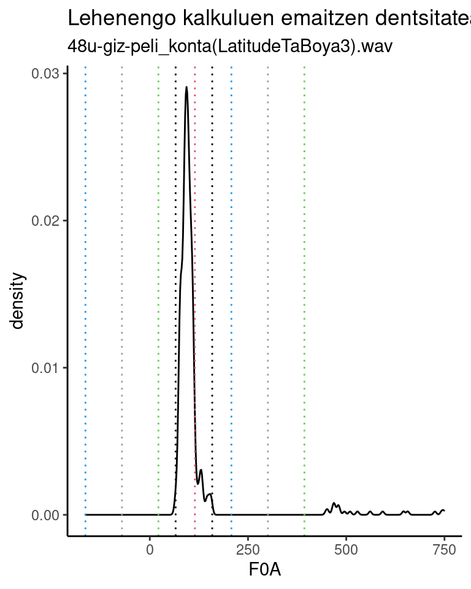
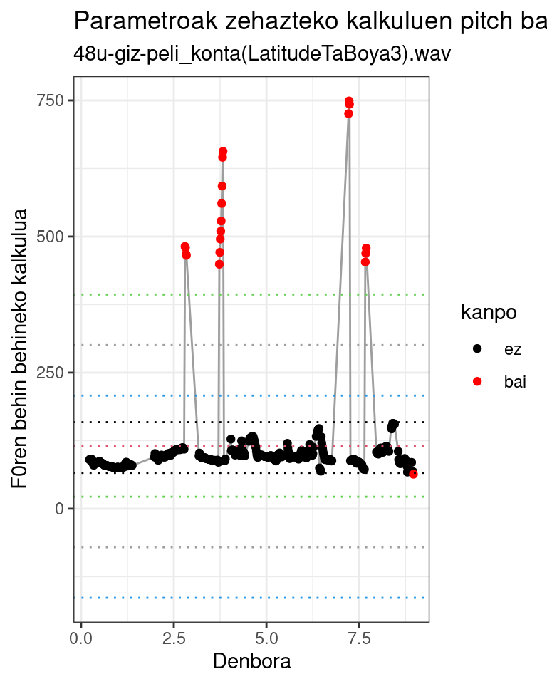
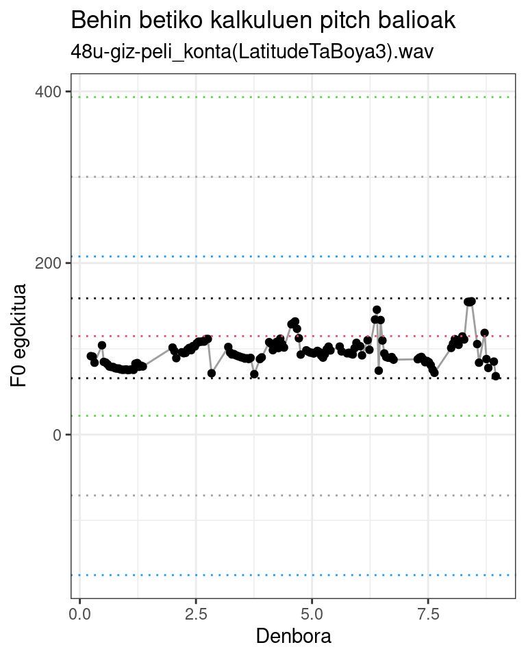
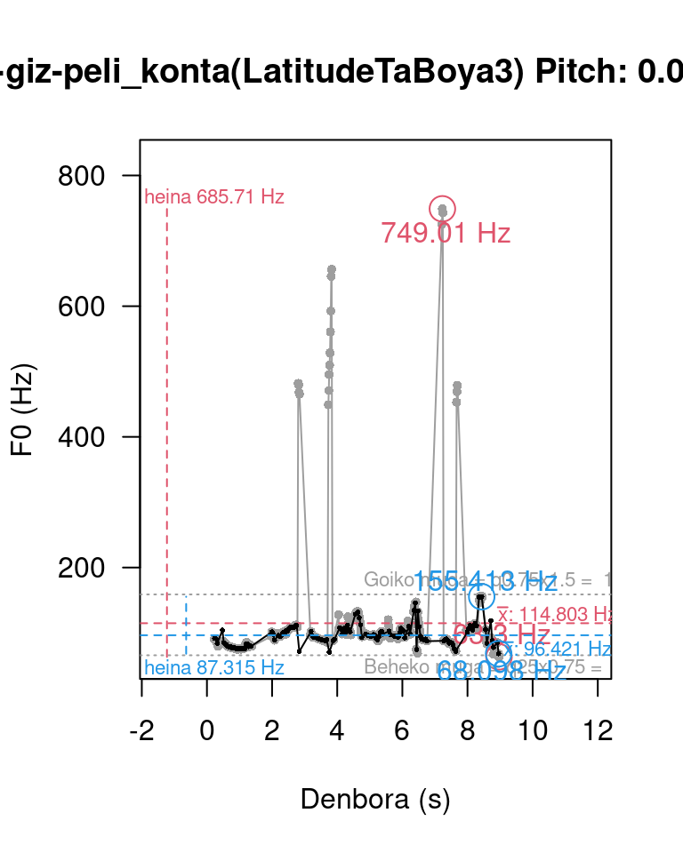
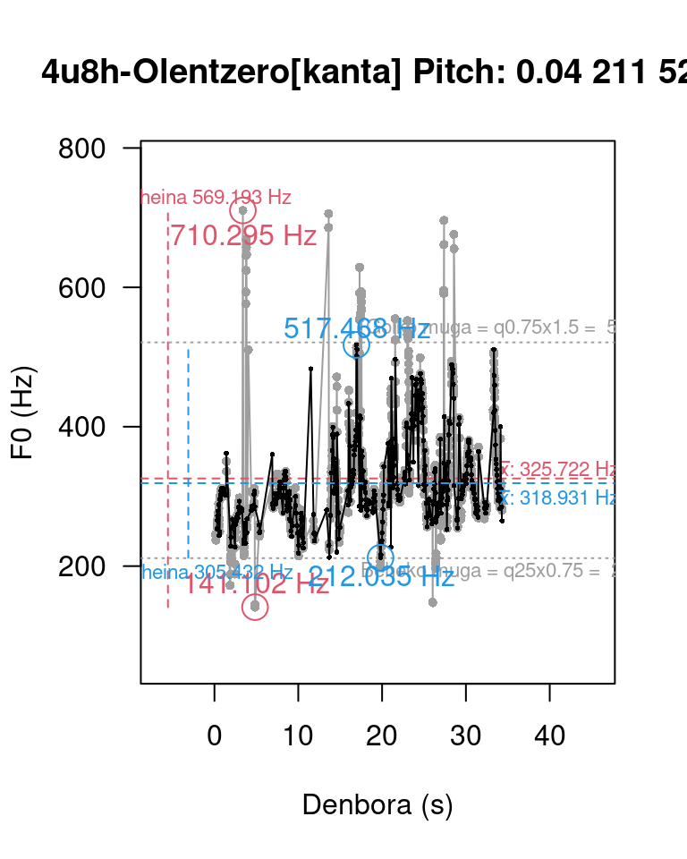
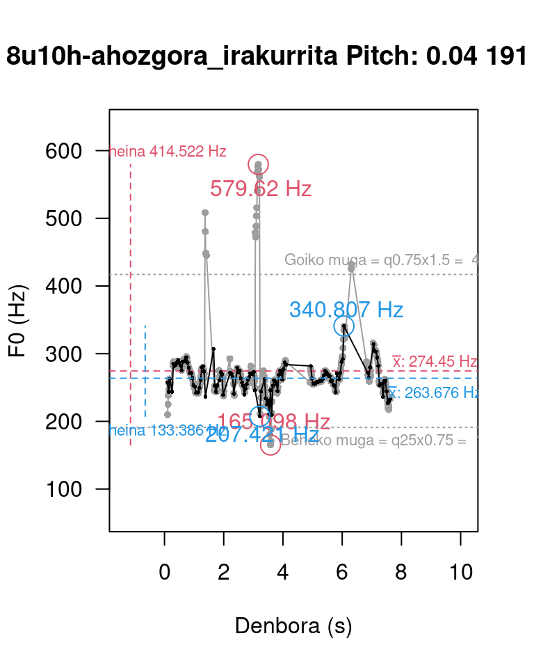
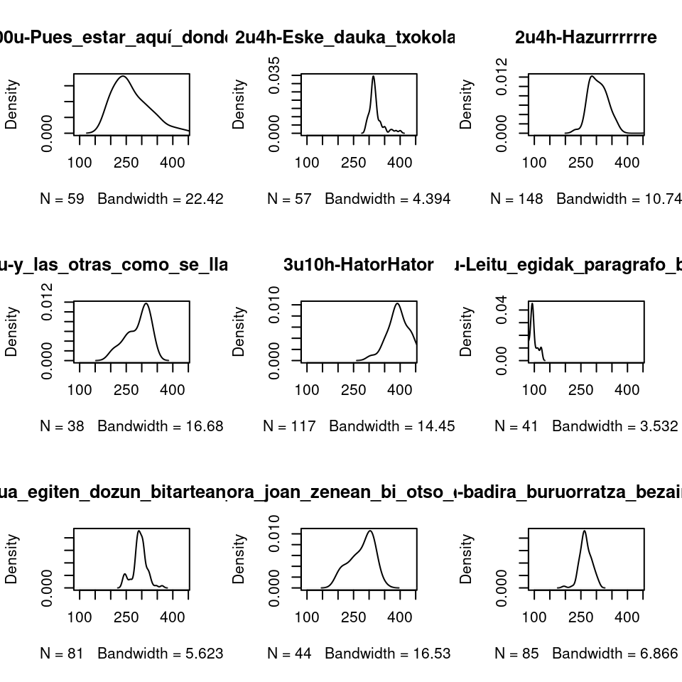
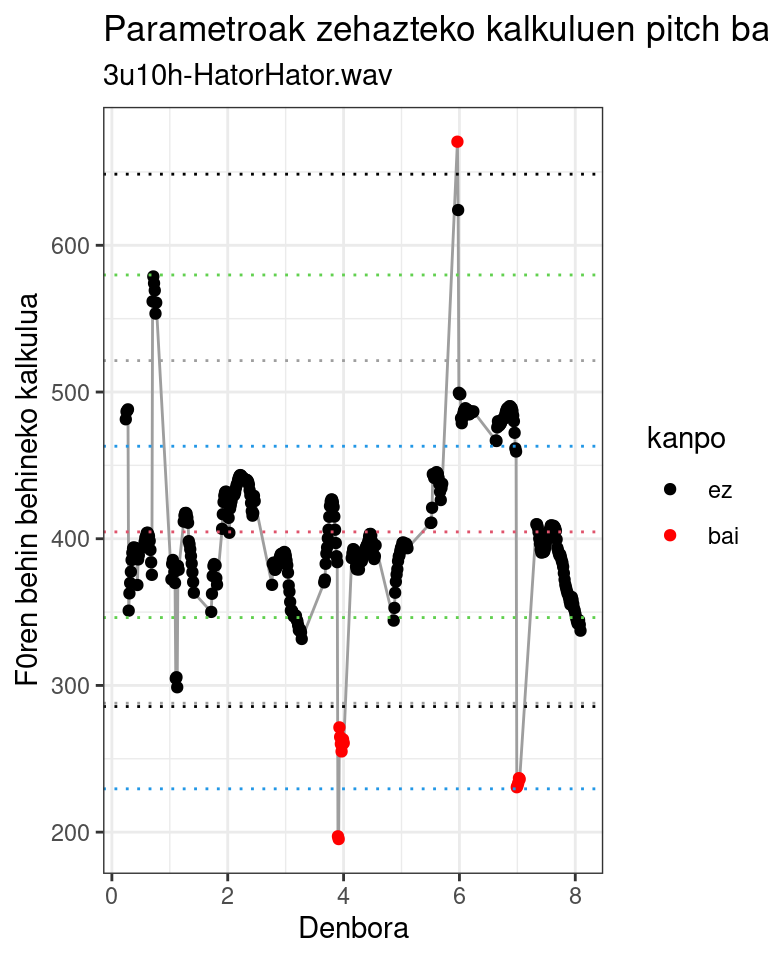
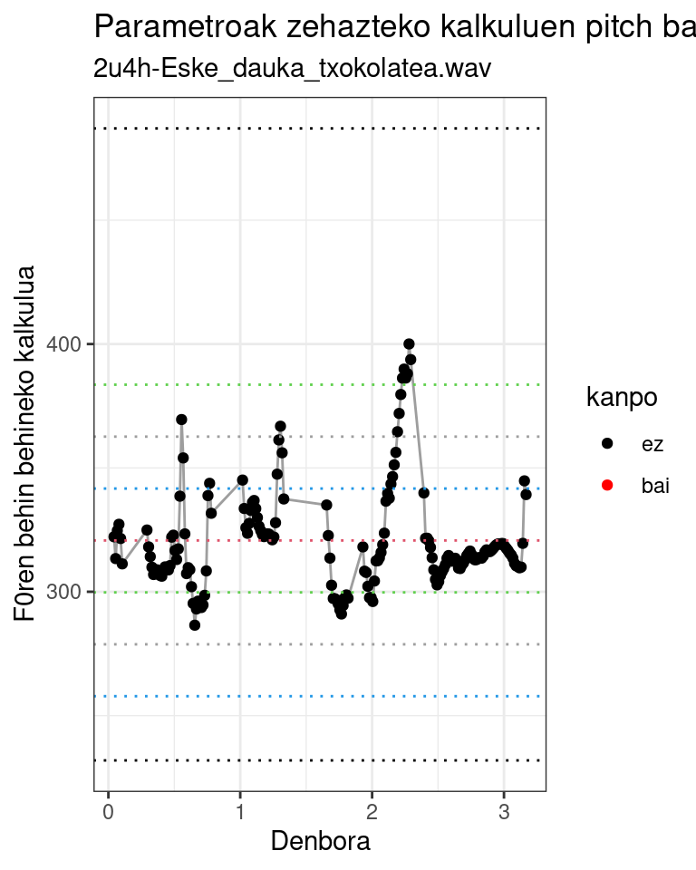
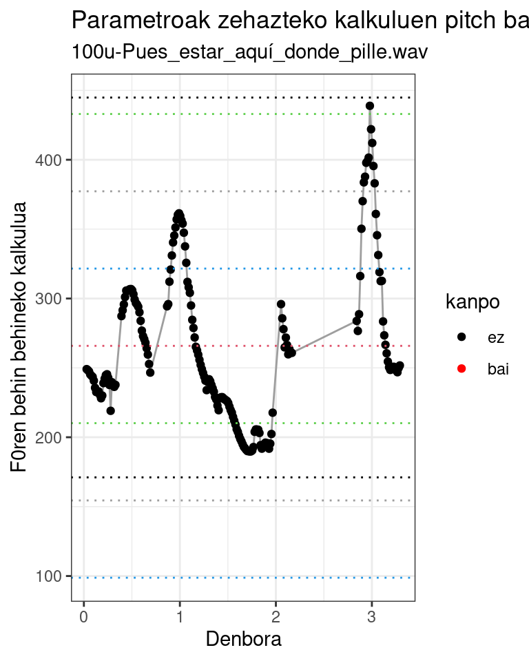

Zarratualdian (Covid-19, 2020... gogoan?) Praat [@boersma2001] erabiltzen ikasten nenbilen, zehazki oinarrizko frekuentzia -*F~0~*- kalkulatzen, marrazten, aztertzen. Horretan nabilela, konturatu nintzen sarri huts egiten zuela berez ateratzen den kalkuluak. Musika eta akustikako eskolatik etorrita, *harmonikoen araberako emaitza ematen zuela* esango nuen.

Script batzuetan aztertuta konturatu nintzen, gainera, emaitzak ez zirela berberak nik pantailan ikus nitzakeenak eta script-ek sortzen zituztenak. Zentzua hartu zuen @correa2015 liburuan irakurritakoak, hau da, andrazkoa ala gizonezkoa izan parametro batzuk aldatu beharra dagoela... baina hori ere, segun zelako ahotsa duen, andrazkoak oso grabe hitz egin dezakeelako eta... **Eta hau zelan automatizatu?**

Han biztu zitzaidan kandelatxoa eta lehenengo hipotesia sortu:

**H~1~**: Baliteke eraren bat egotea errorea modelizatu, parametroak egokitu eta errorez garbi kalkulatzeko.

Horrela, lagin batzuk aztertzeari ekin nion; horretarako, Correaren liburuan proposatutako heinen beherengo eta gorengo balioak hartuta kalkuluak egin eta banaketa plotak egin nituen:

> Pitch range (Hz): con el rango se define el valor mínimo y máximo de F~0~. El valor por defecto es 75Hz-500Hz; para voces femeninas el rango recomendado por los autores del programa es 100Hz--500Hz y para voces masculinas 75Hz-300Hz. En todo caso, estos valores son de referencia y deben modificarse de acuerdo con las características de cada hablante. De lo contrario, el programa generará una curva melódica errónea.
>
> -- J.A. Correa (2015:34)

## Errobera asmatu nahirik

Irudien azterketan nabilela, azterketa bilbiografikoari ere ekin nion, elementuak zein ziren ulertuta. Eta hortxe konturatu nintzen errobera asmatu nahirik nenbilela. De Looze eta Hirst-ek [-@delooze2008] Praaterako plugin batean irtenbide bat proposatua zuten, Evin eta lagunek [-@evin2018] Argentinako hizkeretarako beste bat proposatu zuten eta Zhang eta lagunek [-@zhang2018] aurkeztua zuten bat erraz ulertzen eta errepikatzen.

Denen irtenbidea, parametroak apur bat aldatu arren, berdintsua da:

1.  Hein zabal eta egonkor batean kalkulatu F~0~ erroreduna
2.  Kalkulu horien banaketa ezaugarrien arabera zehaztu hurrengo kalkuluak egiteko heinerako parametroak
3.  Parametro berriekin berriz kalkulatu F~0~ modelatua.

Azken horrek ez luke errorerik izan beharko.

## R-n programatu

R eta Praat elkarrekin erabiltzeko hainbat pakete garatu da, ezaugarri batzuk edo beste batzuk erabiltzeko. Honetan hasi nintzenean `PraatR` , `rPraat` eta `textgRide` zeuden CRANeko biltegietan; gaur badira gehiago ere, besteak beste, `speackr`, `phonfieldwork`, `visvow`, `soundgen` eta beste. Garatzeari utzi zaion arren, denen artean erabiltzen erraz xamar egin zitzaidan `PraatR` paketea [@albin2014], Praateko [komandu ugari](http://www.aaronalbin.com/praatr/commands.html) erabiltzeko aukera ematen du, parametroak ere landuta. Gaur berriro aukeratu behar banu, agian, besteren bat aurkitzea ematen du zentzuzkoena, baina ez nuke jakingo zein. Esan behar da, baina, PraatR paketea astiroago prozesatzen duela rPraat paketeak baino [@boril2016], baina emaitzak errazago egiten direla erakusten.

Pakete horrek Praateri egin behar duena agintzen dio programa horretako scriptek egingo luketen antzera. Horrek suposatzen du, besteak beste, nahitaezkoa dela audioak zein karpetatan dauden zehaztuta, horraxe *working directory* mugitzea, gero norberanera bueltatzeko. Horrez gainera, elementuak Rk eskuratzeko Praatek fitxategiak sortu behar ditu eta fitxategi horiek irakurri behar dira kalkulu berriak egiteko.

## Analisi bat edo batzuk

Gorago aipatutako irizpideei segituta EAPIko [@iglesias2021] lagin batzuk hartu nituen hasieran. Emaitza estandarizatuak lortu nituen (ez ditut hemen erakutsiko) baina interesgarria begitandu zitzaidan etxean egindako grabaketa oso desberdin batzuk sistema honekin tratatzea. Segidan horiek

### Laginaren ezaugarriak

Informatzaileak denak familiakoak dira.

-   2 urteko umea
-   3 urteko umea
-   4 urteko umea
-   8 urteko umea
-   40 urteko andrea
-   48 urteko gizona
-   100 urteko andrea

Eta laginak, luzeraren arabera, multzo bitan ulertu behar dira. Batzuk "luzeak" 10 eta 100 segundu arteko hiru eta bederatzi 3 eta 8 segundu artekoak. Hizkuntzari dagokionez, bizkaiko euskaraz edo gaztelako gaztelaniaz daude.

## Emaitzak

Lehenengo kalkuluak egin nituen irakurgaietan aurkitutako parametroen arabera, 50Hz eta 750Hz artean egin dira kalkuluak (Praatek lehenetsita dakartzan balioak 75Hz eta 500Hz dira). Horien emaitzetan nabarmendu ditut desbiderapen estandarren araberako distantziak(1, urdinez; 2, grisez; 3, berdez) eta batazbestekoa (gorriz); horiei gehitu diet beltzez Evin eta bestek [-@evin2018] proposatutakoa:

$$behekomuga = q1\times 0.75$$

$$goikomuga = q3\times 1.5$$

Begizko azterketak ikus daiteke balioen multzo handia dagoela ehun balioen inguruan eta askoz kopuru baxuagoan beste balio batzuk 450Hzetik gora. Multzo nagusiko balioek argi mugatzen dute marra beltzek; horrek diosku kasu honetan trinkotasuna ondoen erakusten duen muga Evin-ek eta Argentinako intonaziorako proposatutakoa dela.
Horien gainetik eta azpitik zenbait balio aurkitzen badira ere, kalkuluek sortutako outliertzat hartu behar dira eta ezegokiak oinarrizko frekuentzia adierazteko.

{width=80% height=100%}

Adibidetzat hurrengoak ematen ditut:

-   Oinarrizko grabazioa: 8 segundu pasako azalpena, 48 urteko gizonezko batek emandakoa.  
    <html> <audio controls>   <source src="/audioak/prosodiaz202208/48u-giz-peli_konta.wav" type="audio/wav"> </audio></html> [+](/audioak/prosodiaz202208/48u-giz-peli_konta.wav)

-   Grabazio horren *F~0~*ren lehenengo kalkuluan Praatek berreraikitako intonazioa (adi agertzen diren soinu aguduenei)  
    <html> <audio controls>   <source src="/audioak/prosodiaz202208/48u-giz_um-Praateko_parametroak.wav" type="audio/wav"> </audio></html> 
    
-   Grabazio horren F0ren detekzio egokituan oinarrituta, Praatek berreraikitako intonazioa (nik zuzentzat hartuko neukena)  
    <html> <audio controls>   <source src="/audioak/prosodiaz202208/48u-giz_um-parametro_egokituakak.wav" type="audio/wav"> </audio></html> 

Hurrengo irudian ikus daitezke parametroak zehazteko lehenengo kalkuluen araberako *F~0~*ko behin behineko emaitzak. Gorriz nabarmenduta, kalkulu egokitutik kanpo geratutako balioak.

{width=80%}

Azkenik parametro egokituekin sortutako irudia, aurreko irudiaren eskala gordeta.

{width=80%}]

Kalkulu guzti horien laburpen irudia sortu dut, begizko analisia egin ahal izateko. Horien emaitza lagin luzeagoen kasuan hurrengo irudietan beltzez erakutsitakoa da:

{width=32%}
{width=32%}
{width=32%}

*Laburpen irudien azalpena*: Grisez erakusten dira oinarrizko kalkuluen araberako datuak; parametro egokituak marra paralelo eta grisen bitartez erakusten dira, heinak, gehieneko eta gutxieeneko balioak gorriz erakusten dira hasierako pausuko kalkuluetan eta urdinez kalkulu egokituen kasuan.

### Lagin laburrak

Laginak denboran laburrak direnean ez da hain argi igartzen alderik emaitzetan, behintzat kalkuluok egiteko erabilitako audioen analisian. Hori ikus daiteke bederatzi laginon dentsitate grafikoetan, zeintzutan ia ez den ikusten gehiengotik aldentzen den baliorik.

{width=80%}

Laburpen irudi bi ere ekarri ditugu hona, gehien eta gutxien aldentzen diren kalkuluenak.

Alderik nabarmenena hiru urte eta hamar hileko haurraren kantuaren grabazioak erakutsi du:

<html> <audio controls>   <source src="/audioak/prosodiaz202208/3u10h-HatorHator.wav" type="audio/wav"> </audio></html> 
{width=80%}

Alderik ez dute erakutsi, berriz beste bik, bi urteko ume baten azalpenak eta ehun urteko emakume baten erantzunak.

<html> <audio controls>   <source src="/audioak/prosodiaz202208/2u4h-Eske_dauka_txokolatea.wav" type="audio/wav"> </audio></html> 
{width=80%} 

<html> <audio controls>  <source src="/audioak/prosodiaz202208/100u-Pues_estar_aquí_donde_pille.wav" type="audio/wav"> </audio></html> 
{width=80%} 

## Ondorio batzuk

Bistan denez, grabazioak banan-banan ebaluatzen jakinda eta hala eginda, hobeto zehatz daitezke oinarrizko frekuentzia kalkulatzeko parametroak.

Era berean, lagin handiak edo kopuru handiak aztertzeko, oinarrizko frekuentzia kalkulatzeko bide konplexuagoa erabili behar da lehenetsitako parametroak erabilera hutsetik harago. Bide posible eta egingarria proposatu zuten De Loozek eta lagunek (2008) lehenen eta gero Evin eta bestek (2018) eta Zhang eta bestek (2018), honetan bide horren Rrako implementazioak pareko balioak sortzen dituela ikusi da.

### Ekarpen posibleren bat

TextGrideetan silabak, berbak eta abar zehaztuta dauden kasuetan, horien arabera oinarrizko frekuentziaren portaeraren eskuratze automatikoa gara daiteke eta baita etiketazioaren araberako analisiak egiteko aukera ere zabaldu da.

## Scriptak

*F~0~* kalkulu egokituak Rn egiteko.

<small>

``` r
## Praat R-tik erabilita oinarrizko frekuentzia egokiro kalkulatzeko scripta.
##
## Egilea: juan.abasolo@ehu.eus

## 2022/03/20
##


# Paketeak -------------------------------------------

library(PraatR)
library(stringr)

## Prestaketa

hasierako.wd <- getwd()


karpetak <- c(#"/home/urlia/karpeta/"#,
              '/home/urlia/beste_karpeta_bat/'
)

if(str_detect(karpetak,' ')) {
    cat('Espazio hutsek izenetan huts eragiten diote scriptari\n
    izenean edo karpeten izenetan espazio hutsak detektatu dira\n
          ZUZENDU izenak eta hasi berriro.\n\n
          Oharra: Ohiturazkoa da espazioen ordez "_" idaztea')
}
    
# Prozesamendua -----------------------------------------------------

par(mfrow = c(2, 1))

for(taldea in karpetak){
    
    print(taldea)
    
    KarpetaHelburua <- taldea
    
    # Funtzino hau erabilten da dana dalako karpetan dagozan fitxategiak
    # Praat-en kudeatu ahal izateko
    FullBidea <- function(FitxategiIzena) {
        return(paste(KarpetaHelburua, FitxategiIzena, sep = ""))
    }
    
    # PraatR-gaz ibilteko bihar dan sistemi
    setwd(KarpetaHelburua)
    # list.files()
    fitxategiak <- grep('.wav', list.files(), value = T)
    
    for(i in 1:length(fitxategiak)){
        OraingoFitxategiIzena <- c(fitxategiak)[i]
        kodea <- sub(OraingoFitxategiIzena, pattern = '.wav', replacement = '')
        print(OraingoFitxategiIzena)
        
        WaveBidea <- FullBidea(OraingoFitxategiIzena)
        
        ### KONTUZ!!! HONEK FITXATEGIAK SORTZEN DITUZ raw KARPETAN
        ###
        ### 
        PitchBidea <- sub(WaveBidea, pattern = ".wav", replacement = ".Pitch")
        PitchTierBidea <- sub(WaveBidea, pattern = ".wav", replacement = ".PitchTier")
        TextGridBidea <- sub(WaveBidea, pattern = ".wav", replacement = ".TextGrid")
        TableBidea <- sub(WaveBidea, pattern = ".wav", replacement = ".Table")
        
        ## F0
        ## Parametroak kalkulatzeko
        PitchArgumentsA <- list(0.0, 60, 750) # Looze & Hirst, 2008)
        # PitchArgumentsA <- list(0.0, 70, 550) # Argentinakoak (Evin et al, 2018) 

        praat("To Pitch...", 
              arguments = PitchArgumentsA, 
              input = WaveBidea, 
              output = PitchBidea, 
              overwrite = TRUE)
        praat("Down to PitchTier", 
              input = PitchBidea, 
              output = PitchTierBidea, 
              overwrite = TRUE, 
              filetype = "headerless spreadsheet")
        PitchTierDataA <- read.table(PitchTierBidea, 
                                     col.names = c("Time", "F0"))
        
        Time <- PitchTierDataA$Time
        F0A <- PitchTierDataA$F0
        
        muga.behe <- unname(quantile(F0A, probs = 0.25 ))* 0.75
        muga.goi <- unname(quantile(F0A, probs = 0.75))*1.5
        
        # Parametro barriakin
        PitchArgumentsB <- list(0.04,  # Neure egokitzapena Looze & Hirst, 2008)
                                muga.behe, 
                                muga.goi)
        praat("To Pitch...", 
              arguments = PitchArgumentsB, 
              input = WaveBidea, 
              output = PitchBidea, 
              overwrite = TRUE)
        praat("Down to PitchTier", 
              input = PitchBidea, 
              output = PitchTierBidea, 
              overwrite = TRUE, 
              filetype = "headerless spreadsheet")
        PitchTierDataB <- read.table(PitchTierBidea, 
                                     col.names = c("Time", "F0"))
        TimeB <- PitchTierDataB$Time
        F0B <- PitchTierDataB$F0  
        
        ## TextGrid Tablera
        TableArgumentuak <- list(TRUE, # Include line number
                                 6, # Time decimals
                                 TRUE, # Include tier names
                                 FALSE) # Include empty intervals
        if(file.exists(TextGridBidea)){
            praat("Down to Table...",
              arguments = TableArgumentuak,
              input = TextGridBidea,
              output = TableBidea,
              filetype = "tab-separated",
              overwrite = TRUE) 
        }
        assign(paste0('dfpitch.', kodea), PitchTierDataB)
    }
}
```

</small>

Azterketa grafikorako:

<small>

```r
## Ikusizko analisiak egiteko scripta (aurreko scriptaren barruan txertatzekoa)

        ## Azterketa grafikoa ===================================
        ## Sartu soinu datuak -----------------------------------
        
        ## Lehenengoaren dentsitate plota
        
        plot(density(F0A))
        abline(v = mean(F0A), col = 2)
        abline(v = mean(F0A)+sd(F0A), col = 4, lty = 2)
        abline(v = mean(F0A)-sd(F0A), col = 4, lty = 2)
        abline(v = mean(F0A)+sd(F0A)*2, col = 8, lty = 2)
        abline(v = mean(F0A)-sd(F0A)*2, col = 8, lty = 2)  
        abline(v = mean(F0A)+sd(F0A)*3, col = 3, lty = 2)
        abline(v = mean(F0A)-sd(F0A)*3, col = 3, lty = 2)
        abline(v = quantile(F0A, probs = c(0.25, 0.75)) * c(0.75, 1.5), 
               col = 1, 
               lty = 2, cex = 0.5)
        
        ## Irudikatu Praat-eko parametroakin --------------------
        
        ## Sortu irudia, lehenengo kalkuluen pitch uneak
        plot(x = Time, 
             y = F0A, 
             pch = 16, 
             xlab = "Denbora (s)", 
             ylab = "F0 (Hz)", 
             las = 1, 
             main = paste(gsub(OraingoFitxategiIzena, 
                               pattern = '\\....$', 
                               replacement =''), 
                          'Pitch:', 
                          PitchArgumentsB[[1]],
                          round(PitchArgumentsB[[2]]),
                          round(PitchArgumentsB[[3]])), 
             cex = 0.7,
             col = 8,
             ylim = c(PitchArgumentsA[[2]], max(F0A)*1.1),
             xlim = c(min(Time)-(max(Time)-min(Time))/5, 
                      max(Time)+(max(Time)-min(Time))/3))
        ## Batu marra grix bategaz, ondo ikusteko
        lines(x = Time, 
              y = F0A, 
              pch = 16, 
              col = 8)
        ## Nabarmendu zein une detektau dituan gorengo eta beherengo
        points(y = c(max(F0A), min(F0A)), 
               x = c(PitchTierDataA[PitchTierDataA[,2]==(max(F0A)), "Time"],
                     PitchTierDataA[PitchTierDataA[,2]==(min(F0A)), "Time"]), 
               cex = 2, col = 2)
        text(y = c(max(F0A)-35, 
                   min(F0A)+35), 
             x = c(PitchTierDataA[PitchTierDataA[,2]==(max(F0A)), "Time"]+0.1,
                   PitchTierDataA[PitchTierDataA[,2]==(min(F0A)), "Time"]+0.1), 
             labels = c(paste(round(max(F0A), 3), 'Hz'),
                        paste(round(min(F0A), 3), 'Hz')), 
             col = 2)
        ## Lehenengo kalkulun batazbestekoa
        abline(h = mean(F0A), col = 2, lty = 2)
        text(max(Time)+max(Time)/5, 
             mean(F0A)+15, 
             labels = bquote(bar(x)*":" ~.(paste(round(mean(F0A), 3), 'Hz'))),
             col = 2, cex = 0.7)
        ## Lehenengo kalkulun heina
        segments(x0 = min(Time)-(max(Time)-min(Time))/6, y0=min(F0A),
                 x1 = min(Time)-(max(Time)-min(Time))/6, y1 = max(F0A),
                 col = 2,
                 lty = 2)
        text(x = min(Time), 
             y = max(F0A)+20, 
             labels = paste('heina', round(max(F0A)-min(F0A), 3), 'Hz'),
             col = 2, 
             cex = 0.7) 
        
        ## Kalkulu barrion parametroak (goiko eta beheko mugak zehaztu)
        abline(h = c(muga.behe, muga.goi), 
               col = 8, 
               lty = 3)
        text(x = max(Time),
             y = c(muga.goi+20, muga.behe-20),
             labels = c(paste('Goiko muga = q0.75x1.5 = ', round(muga.goi)),
                        paste('Beheko muga = q25x0.75 = ', round(muga.behe))),
             col = 8,
             cex = 0.7)
        
        ## Kalkulu barrijagaz --
        points(x = TimeB, 
               y = F0B, 
               pch = 16, 
               cex = 0.4,
               col = 1)
        lines(x = TimeB, 
              y = F0B, 
              cex = 0.3,
              col = 1)
        ## Max eta min nabarmentu
        points(y = c(max(F0B), min(F0B)), 
               x = c(PitchTierDataB[PitchTierDataB[,2]==(max(F0B)), "Time"],
                     PitchTierDataB[PitchTierDataB[,2]==(min(F0B)), "Time"]), 
               cex = 2, 
               col = 4)
        text(y = c(max(F0B)+25, 
                   min(F0B)-25), 
             x = c(PitchTierDataB[PitchTierDataB[,2]==(max(F0B)), "Time"]+0.1,
                   PitchTierDataB[PitchTierDataB[,2]==(min(F0B)), "Time"]+0.1), 
             labels = c(paste(round(max(F0B), 3), 'Hz'),
                        paste(round(min(F0B), 3), 'Hz')), 
             col = 4)
        
        ## Batazbesteku
        abline(h = mean(F0B), col = 4, lty = 2)
        text(max(Time)+max(Time)/5, 
             mean(F0B)-20, 
             labels = bquote(bar(x)*":" ~.(paste(round(mean(F0B), 3), 'Hz'))),
             col = 4, 
             cex = 0.7)
        
        ## Heina
        segments(x0 = min(TimeB)-(max(Time)-min(Time))/10, y0 = min(F0B),
                 x1 = min(TimeB)-(max(Time)-min(Time))/10, y1 = max(F0B),
                 col = 4,
                 lty = 2)
        text(x = min(TimeB), 
             y = min(F0B)-20, 
             labels = paste('heina', round(max(F0B)-min(F0B), 3), 'Hz'),
             col = 4, 
             cex = 0.7)
        
        ## ggplot
        
        p1 <- data.frame(F0A, Time) |> 
            ggplot(aes(F0A)) +
            geom_density() +
            geom_vline(xintercept=c(mean(F0A)-sd(F0A)*3,
                                    mean(F0A)-sd(F0A)*2,
                                    mean(F0A)-sd(F0A), 
                                    mean(F0A),
                                    mean(F0A)+sd(F0A)*3,
                                    mean(F0A)+sd(F0A)*2,
                                    mean(F0A)+sd(F0A),
                                    quantile(F0A, probs = c(0.25, 0.75)) * c(0.75, 1.5)),
                       color = c(4, 8, 3, 2, 3, 8, 4, 1, 1), lty = 3)+
            theme_classic() +
            labs(title = 'Lehenengo kalkuluen emaitzen dentsitatea',
                 subtitle = OraingoFitxategiIzena)
        print(p1)
        
        p2 <- data.frame(F0A, Time) |> 
            mutate(kanpo = ifelse(F0A>=quantile(F0A, probs = 0.25)*0.75&
                                      F0A<=quantile(F0A, probs = 0.75)*1.5, 
                                  yes = 'ez', 
                                  no = 'bai') |> 
                       as.factor())  |> 
            ggplot(aes(Time, F0A, color = kanpo)) +
            geom_line(color = 8) +
            geom_point() +
            scale_color_manual(values = c("ez" = "black", "bai" = "red")) +
            geom_hline(yintercept=c(mean(F0A)-sd(F0A)*3,
                                    mean(F0A)-sd(F0A)*2,
                                    mean(F0A)-sd(F0A), 
                                    mean(F0A),
                                    mean(F0A)+sd(F0A)*3,
                                    mean(F0A)+sd(F0A)*2,
                                    mean(F0A)+sd(F0A),
                                    quantile(F0A, probs = c(0.25, 0.75)) * c(0.75, 1.5)),
                       color = c(4, 8, 3, 2, 3, 8, 4, 1, 1), lty = 3)+
            theme_bw() +
            labs(title = 'Parametroak zehazteko kalkuluen pitch balioak',
                 subtitle = OraingoFitxategiIzena) +
            ylab('F0ren behin behineko kalkulua') +
            xlab('Denbora')
        print(p2)
        
        p3 <- data.frame(F0B, TimeB) |> 
            ggplot(aes(TimeB, F0B)) +
            geom_line(color = 8) +
            geom_point() +
            geom_hline(yintercept=c(mean(F0A)-sd(F0A)*3,
                                    mean(F0A)-sd(F0A)*2,
                                    mean(F0A)-sd(F0A), 
                                    mean(F0A),
                                    mean(F0A)+sd(F0A)*3,
                                    mean(F0A)+sd(F0A)*2,
                                    mean(F0A)+sd(F0A),
                                    quantile(F0A, probs = c(0.25, 0.75)) * c(0.75, 1.5)),
                       color = c(4, 8, 3, 2, 3, 8, 4, 1, 1), lty = 3)+
            theme_bw() +
            labs(title = 'Behin betiko kalkuluen pitch balioak',
                 subtitle = OraingoFitxategiIzena) +
            ylab('F0 egokitua') +
            xlab('Denbora')
        print(p3)

```

</small>

***

### Erreferentziak