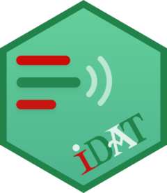

```{r setup, include=FALSE}
knitr::opts_chunk$set(echo=FALSE, 
                      warning=FALSE,
                      message=FALSE, 
                      fig.path = "static")
```

Jo eta kean ibili naiz [@abasoloIdazketaAztertzekoTresna2018; @abasoloOnlinekoIdazkuntzaProzesua2020; @abasoloCaracteristicasCuantitativasProceso2021] eta dagoeneko lortu dut R paketea idaztea, IDAT izenduna eta argitalpenen bat egindakoan publiko egiteko asmoz.

Momentuz praktikak egiten nabil, oraingoan aurton argitaratu dugun artikulu bateko [@abasoloIDATTaldeLaneko2023] irudiak berreraginaz.

Horretan aztertzen dogu idazkuntza prozesuaz zer ikusten den talde lanean, Etherpadeko[^1] pad bateko fitxategia analizatuta.

[^1]: <https://etherpad.org>

Hurrengook ikusten dira lan honetan:

-   Nork zenbat idatzi duen (zenbat karaktere gehitu eta zenbat kendu)
-   Talde lanaren egituraketa tenporala.
-   Idazketa prozesuan nola banatzen den hausnarketako denbora zer egiteko
-   Talde lanean eraikitako testuan nola kolpetzen zaion testuaren osotasunari
-   ... eta testuaren ***topografia***.

## Ezaugarri batzuk

Sei parte hartzaileko talde batek testu koherente bat ekoitzi behar zuen; horretako bost egun zuten. Taldea aurreko urteetan elkarrekin jardundakoa zen; beraz, rol edo paperen esleipena eginda dagoela pentsatzekoa da.

Sei egileen izenak ezabatu eta anonimizatu dira horretarako IDAT 0.1.0ko funtzio aproposa erabilita. Egileen esleitu zaizkien kodeak hauek dira:

-   *E-1*, *E-2*, *E-4*, *E-5*, *E-6* eta *E-7*. Irakurleak kontuan izan dezala *E-3* erabiltzailerik ez dagoela.

## Nork zenbat idatzi

Lehenengo irudi honek sei egileetariko bakoitzak egindako ekarpen kopurua irudikatzen du. Zenbat idatzi duen eta zenbat testu ezabatu duen ikusten da.

Kontuan izan behar da aparteko beste nonbait idatzitakoa ekarri den momentua, hau da "kopiatu eta itsatsi" jarduetakoa, pausu bakartzat hartzen duela. Berdin, ezabatutako testua luzea zein laburra izan, ezabaketa kopurua islatzen da, ez ezabatutakoaren tamaina eta gehitze ekintzak, ez gehitutakoaren tamaina.

```{r}
readRDS('egosita/01-gg_nokzemat.rds')
```

Hemen bistan dago, pad horretan behintzat, *E-7* etiketadun egileak beste guztiek baino gutxiago landu dutela testua. *E-5* etiketadunak, berriz, ezabatu du gehien. Eta lan gehien *E-2*k egin duela ere nabarmena da.

Horrek zalantza batzuk sort ditzake; besteak beste, zer gehitu den, zer kendu den, noiz kendu den... eta abar.

## Talde lanaren egituraketa tenporala

Esanda dago lana egiteko 5 egun zutela. Hori nola kudeatu da? Egitekoa jaso eta segidan kolpe zaio? Azken ordurako utzi da? Bost egunean zehar landu da?

Hurrengo irudiak ematen du informazio hori:

```{r}
readRDS('egosita/02-gg_noz_zemat_osorik.rds')

```

Hor ikusten denez irailaren 10aren gau edo iluntzean zerbait egin zen eta irailaren hamalauko iluntzean ere beste zerbait. Hala ere, lanaren garapen osoa irailaren 13ko goizerantz egin zela ematen du.

Baina zelan egin zen hori? Nork?

```{r}
readRDS('egosita/03-gg_noz_zemat_lan_tartea.rds')
```

Hor zehaztasun handiz ikusten da talde lanean egin zela lana, baina *E-2* etiketadunak egin zituela azken ezabaketa batzuk (lanaren tamainak behera egiten du nabarmen, horren jardunaren ondorioz 11:40 inguruan).

## Idazketa prozesuan zelan banatzen den hausnarketako denbora zer egiteko

Hori erakusteko eraiki da hurrengo grafikoa. Horretan ekintza guztien lagin bat aukeratu da; segundu bi eta minutu bateko etenen ondoren egin beharrekoa.

Pentsatzekoa da (eta teoriak halan dio, @kauferComposingWrittenSentences1986) segundu bitik gorako etenak islatzen dutela testutik distantzia bat, testuaren eraikuntzan segitzeko. Suposatzen da hogei segundutik gora eta minutu batetik beherakoek testuaren egituraketaren inguruko jardunetarako erabiltzen direla; baina egileek ez dute aho batez hala baieztatzen [@hayesIdentifyingOrganizationWriting1980; @hayesNaturePlanningWriting1996; @kauferComposingWrittenSentences1986; @kelloggWorkingMemoryWritten2013; @meulemansGeneralizabilityPauseTimes2022].

```{r}
readRDS('egosita/04-gg_etenak_jitter.rds')
```

Irudian beltzez irudikatzen dira gehitze ekintzak eta laranjaz kentze ekintzak; horrek erakusten digu *E-5* etiketaz zehaztutako ikasleak ezabaketa (garbiketa?) jardunean ibili dela gehiago, edo ekinago behinik behin, beste egileek baino.

Gutxien parte hartu duen egileak *E-7*k erakusten du eten gutxien, uste izatekoa zenez.

## Testu osoan jardunaz

Hurrengo irudiak adierazten du ekintza bakoitza aurreko ekintzatik zenbat lerrotara egin duen. Hau da, idatzi jarraian aritzen bada lerroan bertan (0) edo hurrengoan (1) adieraziko da. Paragrafoen artean hutsune bat uzten duen egileak biko distantzia ere (2) marka lezake testuan aurrera idatziaz.

Era berean, aurreko paragrafotik zenbat eta distantzia handiagoak hartu, badirudi orduan eta osotasunagoan hartzen duela testu osoa, egituraketa lanak osotasunean egin ohi dira-eta.

```{r}
readRDS('egosita/05-gg_lerro_aldaketak.rds')
```

Aurreko irudi horretan ikusten denez, *E-5* etiketadun egileak egin ditu testua osotasunean egituratzeko ekintzarik hurrunenak. Baina baita *E-1*ak eta *E-2*k ere.

## Testuaren topografia

Azkenik prozesu osoaren erakusgarri: **testuaren eraikuntzaren topografia**.

Lerrorik lerro nork idatzi ala ezabatu duen adierazten da dagokion kolorez. Testua gehitu den (●) ala ezabatu den (▲) ikurrez erakusten da. Eta beste nonbaitetik ekarritakoak zein testu handiak ezabatu diren, ikurraren tamainaz adierazten da. Amaitzeko, prozesuaren hurrenkera ezkerretik eskuinera adierazoten da, pausorik pausu (ez denboran zehar).

```{r}
readRDS('egosita/06-gg_testuaren_topografia.rds')
```

Aurreko irudietan ikusi ditugun testu antolaketako akdaketa horiek argiago uler daitezke. Begiratu, bestela, *E-5*ari eta *E-2*ri. Horietan. Hasieran *E-2*k ezabatzen ditu aurretiko testuak eta segidan *E-5*k itsasten du testu handi bat. Ematen du hurrengo pausuetan testu horretan hasten direla idazten hasieran *E-6* eta lehenengo esaldi batzuk idatzitakoan *E-4*k eta *E-7*k beranduagoko esaldi bi batera idazten dute.

# Beraz...

... hurreraketa grafiko batetik hainbat informazio lor daiteke.

... taldeko lan baten egituratze prozesuaz hainbat ezaugarri erraz ikus daitezke.

... ikasleak balira egileak, haiei prozesuaz galdetzeko eta hausnartzeko aukera eman lezake honek.

## Eta...

... komenigarria litzateke berau ondo eta erraz lortzeko interface grafikoa eskura izatea.

... zenbakizko laburpena ere egingarria da.

...idazketaz ikertzeko tresna eraginkorra izan daiteke hauek denak egiteko erabili dodan IDAT.

Hori, laster batean, baina ez oraindik:

{width="150px"}

# Erreferentziak
